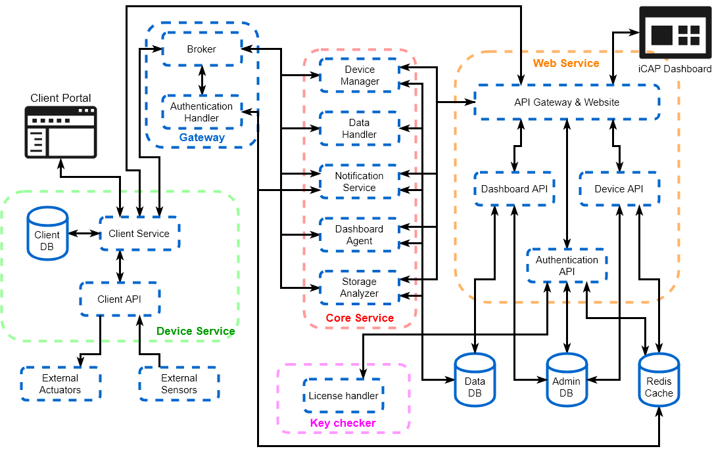
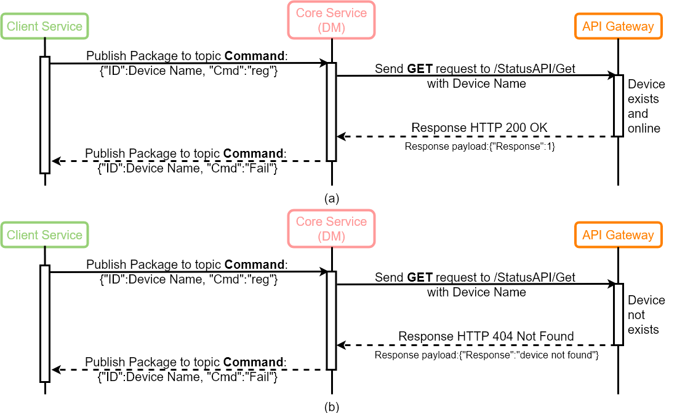
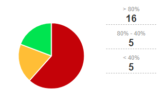
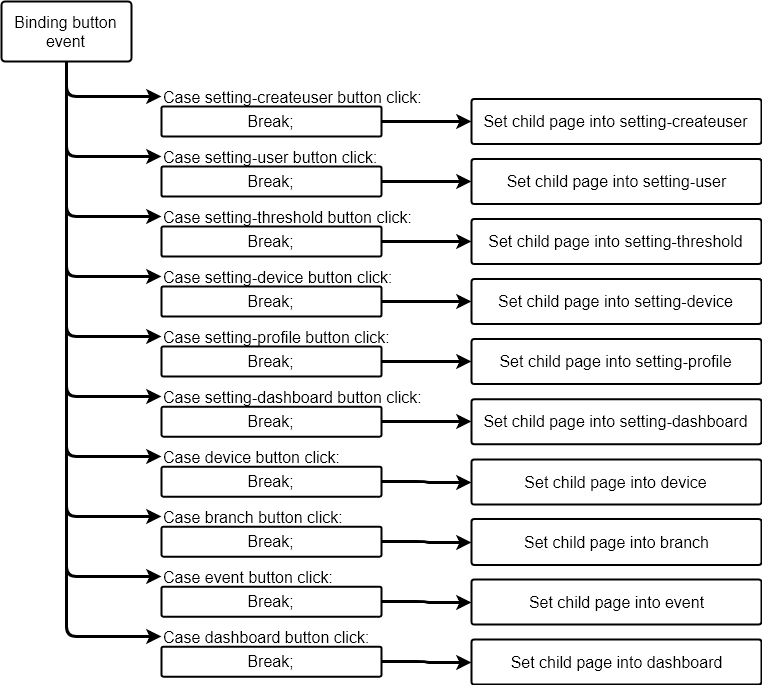
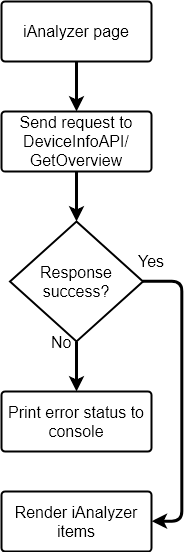

# Innodisk Cloud Administrator Platform (iCAP) System Design Document

## Table of content
1. [Introduction](#1-introduction) 
    1. [Purpose](#11-purpose)
    2. [Scope](#12-scope)
    3. [Overview](#13-overview)
    4. [Reference Material](#14-reference-material)
    5. [Definitions and Acronyms](#15-definitions-and-acronyms)
2. [System Overview](#2-system-overview)
    1. [Features](#21-features)
    2. [System Diagram](#22-system-diagram)
3. [System Architecture](#3-system-architecture)
    1. [Architectural Design](#31-architectural-design)
    2. [Decomposition Description](#32-decomposition-description)
    3. Design Roationale
4. [Data Design](#4-data-design)
    1. [Data Description](#41-data-description)
        1. [Device token, Device naming rule, and website user token](#411-device-token-device-naming-rule-and-website-user-token)
        2. [Web service API definition](#412-web-service-api-definition)
        3. [Protocol design for devices](#413-protocol-design-for-devices)
            1. [RESTful-based protocol](#4131-restfulbased-protocol)
            2. [MQTT-based protocol](#4132-mqtt-based-protocol)
            3. [Socket-based protocol](#4133-socket-based-protocol)
            4. [Multiple-based protocol](#4134-multiple-based-protocol)
            5. [Device site web API definition](#4135-device-site-web-api-definition)
        4. [Protocol design for cluster manager](#414-protocol-design-for-cluster-manager)
    2. [Data Dictionary](#42-data-dictionary)
        1. [Administration Database Structure Definition](#421-administration-database-structure-definition)
        2. [Data Database Structure Definition](#422-data-database-structure-definition)
        3. [Redis Cache Structure Definition](#423-redis-cache-structure-definition)
        4. [Client Service Database Structure Definition](#424-client-service-database-structure-definition)
        5. [Device Static Raw Data Structure Definition](#425-device-static-raw-data-structure-definition)
        6. [Device Dynamic Raw Data Structure Definition](#426-device-dynamic-raw-data-structure-definition)
5. [Component Design](#5-component-design)
    1. [Client Service](#51-client-service)
    2. [Gateway](#52-gateway)
    3. [Core Service](#53-core-service)
    4. [Web Service](#54-web-service)
    5. [Cluster Manager](#55-cluster-manager)
6. [Human Interface Design](#6-human-interface-design)
    1. [iCAP Dashboard](#61-icap-dashboard)
    2. [Device portal](#62-device-portal)
    3. [Management console](#63-management-console)
7. [Requirements Matrix](#7-requirements-matrix)
8. [Appendices](#8-appendices)

<div style="page-break-after: always;"></div>

# 1. Introduction
Innodisk cloud administration platform (iCAP) is a remote device management system for both private and public clouds, which primarily focuses on storage device management and monitoring.
In this section, we will give an brief overview of the iCAP.

## 1.1 Purpose
This document will describe the details of iCAP system design, including system architecture, protocols, data schemas, and UI design.

## 1.2 Scope

## 1.3 Overview

## 1.4 Reference Material

## 1.5 Definitions and Acronyms

<div style="page-break-after: always;"></div>

# 2. System Overview
In this section, we will take an overview of the iCAP system.

## 2.1 Features
In our design, the iCAP has many features to add-on the system value, to improve our future.
iCAP features can divide into three catalog:

- Device surveillance service
- Data analysis service
- Device remote service

At following of this section, we will describe the features of every subcatalog in details.
### Device surveillance service

- System information
- S.M.A.R.T. information (iSMART)
- External sensor information
- System failure notification

### Data analysis service

- SSD life cycle estimation
- System life cycle estimation
- Storage usage estimation
- Recommended system failure solution

### Device remote service

- System auto backup \& recovery

## 2.2 System Diagram

<div style="page-break-after: always;"></div>

# 3. System Architecture
In this sections, we will discuss the system architecture of the iCAP System.

## 3.1 Architectural Design
The iCAP system is based on a microservice architecture, which is reference to the internet of things (IoT) and machine-to-machine (M2M) system.
Figure 1 shows the architecture of our system.

<figure align=center>
    
    <figcaption>Figure 1: iCAP System Architecture</figcaption>
</figure>

The iCAP Client including the device service, which is an applicaion run on devices.
The device service use to collect the device information, includeing device hardward information, system information, and external sensor information, etc.
Device service will send collected data to server each interval, and ran as an system service on Microsoft Windows or daemon on Linux.
On the other hand, device service provide the API for users can add the external sensors and remote devices by itself.

In our design, all of the components in iCAP server will run as containers, which is provide from the Docker service.
The iCAP server including many parts, lists as following:

- Service gateway

    The service gateway is use to became a bridge between with the client service and the core service.
	However, since the devices are communication with server through the MQTT, the service gateway including a MQTT broker to provide the MQTT protocol.

- Core service

    The core service is use to management devices, including device status management, raw data handling, feature analysis.

- Service data base

    In service data base, we both use relational and non-relational database in this system.
    The DB will record the raw data, analysis data result, device profile, and user profile.

- Web service

    The web service is design for serve users interactive with the iCAP server, including website and RESTful APIs.

- Key checker

    The key checker is used to maintain the key-pro status, use to check the license of the iCAP server.

## 3.2 Decomposition Description
Based on our design, the iCAP system architecture including many components, the components can divide into six parts:

- Device Service

    The following figure shows the device service architecture:

    

    * Client Service

        The client service is designed for collection device information and communication with iCAP server. 
        Moreover, it provided the users can add external sensor or external actuators dynamically to management from iCAP server.

    * Client API

        The client API is used for dynamic add external sensor or external actuators.

    * Client Portal

        The client portal provided a website to setup the client service. 
        On the other hand, it also provided the device status on its dashboard, such as CPU loading, memory loading, and storage lifespan. 
        Moreover, provided the local event log on the event page.

    * Client DB

        The client DB used to store the portal needed data and the client service setting parameters.

    * External Actuators & External Sensors

        In our design, the external actuators and external sensors are came from users. The users must provide the interface to communicate with these devices.

- Service Gateway

    The service gateway architecture is shown as following:

    

    * Broker

        The broker is known as the MQTT broker, which provided the MQTT protocol for the iCAP server.

    * Authentication Handler

        The authentication handler is designed to update the broker's login username and password.

- Core Service

    The following figure shows the core service architecture of our design:

    

    * Device Manager

        The device manager is designed for management devices, such as device registration, device status surveillance, and trigger device information upload.

    * Data Handler

        Since we need to store the raw data for future processing, we designed the data handler to processing.
        That is, the data handler will write the raw data which published from the RawData topic into the Mongo DB.

    * Notification Serivce

        The notification service is designed to notify users of the event message, via iCAP dashboard, email, or any IM applications. 

    * Dashboard Agent

        As its name says, the dashboard agent provided the dashboard data for the iCAP server. It will calculate the dashboard data and insert into the Mongo DB.

    * Storage Analyzer

        The storage analyzer is designed to calculate the storage lifespan of the managed devices.
        The lifespan result will insert into the Mongo DB.

- Service DB

    The following figure shows the service DB architecture of our design:

    

    * Admin DB

        The admin (administration) DB is designed for the data store of the iCAP website.
        Including user information, device information, and widget parameters, etc.

    * Data DB

        The data DB is designed for the raw data store which came from devices.
        Not only the raw data storing, the calculated result from core services also store on it.

    * Redis Cache

        The redis cache on iCAP is used for keep the user token and device status.
        On the other hand, it became a broker for the services in the iCAP since it provides the event broker mechanism.

- Web Service

    The following figure shows the web service architecture of our design:
    
    

    * API Gateway

        The API gateway is the entry point of the web service, which will forward all the package into other services.
        For example, while it receives the authentication request, the package will forward into the Authentication API to processing the request.

    * Website

        The website provides the user interface of the iCAP service, including the dashboard, event log, and device information, etc...
        In the implementation of the iCAP server, the website will be packed into few static files and placed into the API gateway.
    
    * Authentication API

        As its naming, this API provided the authentications of the users and devices.
        However, the CRUD (create, read, update, delete) of the employee information also provides on this API.

    * Dashboard API

        The dashboard API provided the dashboard data, event logs, and settings of the iCAP server.
        Since the dashboard is combining with many widgets, the CRUD of the widget also provides on this API.

    * Device API

        The device API provided all of the device information, including devices status, device overview, and device details.
        And the setting of device branch also provides on this API.

- Key checker

    The key checker is designed for management the license with the Key-pro hardware key.
    It can provides the Key-pro connection status and read the iCAP service licence which stored on the Key-pro.

<div style="page-break-after: always;"></div>

# 4. Data Design
In this section, we will describe the design of iCAP, including protocol, database schema, and raw data.

## 4.1 Data Description
Since the iCAP system combined with many components, we need to define some protocols for inter-component-communications.
The figure 7 shows the iCAP data flow for our design:

<figure align=center>
    
    <figcaption>Figure 7: iCAP data flow</figcaption>
</figure>

In the less of this section, we will describe the design of iCAP data flow.

### 4.1.1 Device token, Device naming rule, and website user token
The iCAP is a client management system, however, to avoid the data collision of devices, we design the [device identify name](#device-identify-name) and [authentication token](#authentication-token).

#### **Authentication Token**
The material of the authentication token are including:
- Motherboard serial number
- First storage serial number

And the following step are using for generate token:

1. Combine : Motherboard serial number + First storage serial number
2. Remove special characters: / \\ . " $ * < > : | ?
3. Downcast all characters
4. Encoding with BASE64 algorithm

After these 4 step, the result will be the token for the device registration to the iCAP service.

> ### **Here is an example for generating token:**
> Our material:
> - Motherboard SN : /5T3KK22/CN1296651G00A5/
> - First storage SN : 20160901AA0918000011
>
> 1. Combine:
>
>> /5T3KK22/CN1296651G00A5/20160901AA0918000011
>
> 2. Remove special characters:
>
>> 5T3KK22CN1296651G00A520160901AA0918000011
>
> 3. Downcast all characters:
>
>> 5t3kk22cn1296651g00a520160901aa0918000011
>
> 4. BASE64 encoding:
>
>> NXQza2syMmNuMTI5NjY1MWcwMGE1MjAxNjA5MDFhYTA5MTgwMDAwMTE=
>

#### **Device Identify Name**
The device identify name is using a simple rule to define:
> Device + serial number

For example
> Device00001, Device00002 ...

#### **Website user token**
The website user token is used to identify the user login session from the browser.
We used the specify characters to generate a random string, which contain:
> abcdefghijkmnopqrstuvwxyzABCDEFGHJKLMNOPQRSTUVWXYZ0123456789!@-=

After that, encoding the random string with BASE64 to be the user token.

### 4.1.2 Web service API definition
In the design of iCAP, the API of the webservice will divide into 3 components:
- [Authentication API](#authentication-api)
- [Dashboard API](#dashboard-api)
- [Device API](#device-api)

In the less of this section, we will describe the API definition of the websevice.

### **Authentication API**
Here is a list of the authentication API:
1. [Device authentication](#1-device-authentication)
2. [Employee authentication](#2-employee-authentication)
3. [Check token](#3-check-token)
4. [Check administrator](#4-check-administrator)
5. [Create employee](#5-create-employee)
6. [Get employee information](#6-get-employee-information)
7. [Get employee information from token](#7-get-employee-information-from-token)
8. [Update employee information](#8-update-employee-information)
9. [Delete employee](#9-delete-employee)
10. [Get employee list](#10-get-employee-list)

And this API contains models:
1. [Employee profile template](#1-employee-profile-template)

###  Authentication API definitions

> ### **1. Device authentication**
> ---
> **Request path:** /AuthenticationAPI/GetID
>
> **Request method:** GET
>
> **Summary:** This API provides the device Id for the iCAP client service.
> 
> **Parameters**
> 
> | Name       | Located in | Description                                       | Required | Schema |
> |------------|------------|---------------------------------------------------|----------|--------|
> | Thumbprint | header     | The device thumbprint which generated from device | No       | string |
> 
> **Responses**
> 
> | Code | Description                   |
> |------|-------------------------------|
> | 200  | Authentication success        |
> | 403  | Device already over limitaion |
> | 404  | Not Found                     |
> | 500  | Server Error                  |

> ### **2. Employee authentication**
> ---
> **Request path:** /AuthenticationAPI/Login
>
> **Request method:** GET
>
> **Summary:** This API provides employees login token.
> 
> **Parameters**
> 
> | Name     | Located in | Description          | Required | Schema |
> |----------|------------|----------------------|----------|--------|
> | Username | header     | The name of the user | No       | string |
> | Password | header     | Login password       | No       | string |
> 
> **Responses**
> 
> | Code | Description                          |
> |------|--------------------------------------|
> | 200  | Authentication success               |
> | 403  | User is not exists or wrong password |

> ### **3. Check token**
> ---
> **Request path:** /AuthenticationAPI/TokenChecker
>
> **Request method:** GET
>
> **Summary:** This API used for checking the token availability.
> 
> **Parameters**
> 
> | Name  | Located in | Description        | Required | Schema |
> |-------|------------|--------------------|----------|--------|
> | token | header     | The identity token | No       | string |
> 
> **Responses**
> 
> | Code | Description          |
> |------|----------------------|
> | 200  | Get response success |

> ### **4. Check administrator**
> ---
> **Request path:** /AuthenticationAPI/CheckAdmin
>
> **Request method:** GET
>
> **Summary:** This API used for checking the token availability of administrator.
> 
> **Parameters**
> 
> | Name  | Located in | Description        | Required | Schema |
> |-------|------------|--------------------|----------|--------|
> | token | header     | The identity token | No       | string |
> 
> **Responses**
> 
> | Code | Description          |
> |------|----------------------|
> | 200  | Get response success |

> ### **5. Create employee**
> ---
> **Request path:** /EmployeeAPI/Create
>
> **Request method:** POST
>
> **Summary:** This API used to creating employee of the iCAP system.
> 
> **Parameters**
> 
> | Name    | Located in | Description        | Required | Schema                                              |
> |---------|------------|--------------------|----------|-----------------------------------------------------|
> | token   | header     | The identity token | No       | string                                              |
> | payload | body       | The employee data  | No       | [EmployeeProfileTemplate](#employeeprofiletemplate) |
> 
> **Responses**
> 
> | Code | Description                  |
> |------|------------------------------|
> | 201  | Create employee success      |
> | 403  | The identity token not found |
> | 406  | Employee data error          |
> | 500  | Internal server error        |

> ### **6. Get employee information**
> ---
> **Request path:** /EmployeeAPI/Get
>
> **Request method:** GET
>
> **Summary:** This API used to get the employee information of the iCAP system.
> 
> **Parameters**
> 
> | Name      | Located in | Description        | Required | Schema |
> |-----------|------------|--------------------|----------|--------|
> | loginName | query      | User login name    | No       | string |
> | token     | header     | The identity token | No       | string |
> 
> **Responses**
> 
> | Code | Description                         |
> |------|-------------------------------------|
> | 200  | Get employee profile success        |
> | 402  | Request does not contain login name |
> | 403  | The identity token not found        |
> | 404  | Employee not found                  |

> ### **7. Get employee information from token**
> ---
> **Request path:** /EmployeeAPI/GetFromToken
>
> **Request method:** GET
>
> **Summary:** This API used to get the employee information of the iCAP system from token.
> 
> **Parameters**
> 
> | Name  | Located in | Description        | Required | Schema |
> |-------|------------|--------------------|----------|--------|
> | token | header     | The identity token | No       | string |
> 
> **Responses**
> 
> | Code | Description                         |
> |------|-------------------------------------|
> | 200  | Get employee profile success        |
> | 402  | Request does not contain login name |
> | 403  | The identity token not found        |
> | 404  | Employee not found                  |

> ### **8. Update employee information**
> ---
> **Request path:** /EmployeeAPI/Update
>
> **Request method:** PUT
>
> **Summary:** This API used to update the employee information of the iCAP system.
> 
> **Parameters**
> 
> | Name    | Located in | Description        | Required | Schema                                              |
> |---------|------------|--------------------|----------|-----------------------------------------------------|
> | token   | header     | The identity token | No       | string                                              |
> | payload | body       | The employee data  | No       | [EmployeeProfileTemplate](#employeeprofiletemplate) |
> 
> **Responses**
> 
> | Code | Description                     |
> |------|---------------------------------|
> | 200  | Update employee profile success |
> | 202  | Success                         |
> | 403  | The identity token not found    |
> | 404  | Employee not found              |
> | 406  | Employee data error             |

> ### **9. Delete employee**
> ---
> **Request path:** /EmployeeAPI/Delete
>
> **Request method:** DELETE
>
> **Summary:** This API used to delete the employee information of the iCAP system.
> 
> **Parameters**
> 
> | Name      | Located in | Description        | Required | Schema |
> |-----------|------------|--------------------|----------|--------|
> | loginName | header     | User login name    | No       | string |
> | token     | header     | The identity token | No       | string |
> 
> **Responses**
> 
> | Code | Description                  |
> |------|------------------------------|
> | 202  | Delete employee success      |
> | 403  | The identity token not found |
> | 404  | Employee not found           |
> | 406  | Employee data error          |
> | 500  | Internal server error        |

> ### **10. Get employee list**
> ---
> **Request path:** /EmployeeAPI/List
>
> **Request method:** GET
>
> **Summary:** This API used to get the employee list of the iCAP system.
> 
> **Parameters**
> 
> | Name  | Located in | Description        | Required | Schema |
> |-------|------------|--------------------|----------|--------|
> | token | header     | The identity token | No       | string |
> 
> **Responses**
> 
> | Code | Description                  |
> |------|------------------------------|
> | 200  | Get employee list success    |
> | 202  | Success                      |
> | 403  | The identity token not found |

### Authentication API Models

> ### **1. Employee profile template**
> ---
> **Model name:** EmployeeProfileTemplate  
> 
> | Field Name     | Type    | Description | Required |
> |----------------|---------|-------------|----------|
> | loginName      | string  |             | No       |
> | email          | string  |             | No       |
> | employeeNumber | string  |             | No       |
> | firstName      | string  |             | No       |
> | lastName       | string  |             | No       |
> | pwd            | string  |             | No       |
> | verifyPWD      | string  |             | No       |
> | photoURL       | string  |             | No       |
> | adminFlag      | boolean |             | No       |
---

### **Dashboard API**
Here is a list of the authentication API:
1. [Get company dashboard](#1-get-company-dashboard)
2. [Get all event logs](#2-get-all-event-logs)
3. [Get new event logs](#3-get-new-event-logs)
4. [Get already done event logs](#4-get-already-done-event-logs)
5. [Update event logs](#5-update-event-logs)
6. [Update e-mail sender setting](#6-update-e-mail-sender-setting)
7. [Get e-mail sender list](#7-get-e-mail-sender-list)
8. [Delete e-mail sender](#8-delete-e-mail-sender)
9. [Send notification via e-mail](#9-send-notification-via-e-mail)
10. [Get e-mail sender setting parameter](#10-get-e-mail-sender-setting-parameter)
11. [Get notification e-mail list](#11-get-notification-e-mail-list)
12. [Create company dashboard setting](#12-create-company-dashboard-setting)
13. [Get company dashboard setting](#13-get-company-dashboard-setting)
14. [Update company dashboard setting](#14-update-company-dashboard-setting)
15. [Delete company dashboard setting](#15-delete-company-dashboard-setting)
16. [Create threshold setting](#16-create-threshold-setting)
17. [Get threshold setting](#17-get-threshold-setting)
18. [Update threshold setting](#18-update-threshold-setting)
19. [Delete threshold setting](#19-delete-threshold-setting)
20. [Create widget](#20-create-widget)
21. [Get widget information](#21-get-widget-information)
22. [Update widget](#22-update-widget)
23. [Delete widget](#23-delete-widget)
24. [Get panel item data](#24-get-panel-item-data)
25. [Get data location](25-get-data-location)
26. [Get device list by company id](26-get-device-list-by-company-id)
27. [Get storage list by company id](27-get-storage-list-by-company-id)
28. [Get dashboard name list by company id](28-get-dashboard-name-list-by-company-id)

And this API contains models:
1. [Event data template](#1-event-data-template)
2. [E-mail setting template](#2-e-mail-setting-template)
3. [E-mail sending information template](#3-e-mail-sending-information-template)
4. [Threshold setting template](#4-threshold-setting-template)
5. [Widget template](#5-widget-template)

### Dashboard API definitions

> ### **1. Get company dashboard**
> ---
> **Request path:** /DashboardAPI/Get
>
> **Request method:** GET
>
> **Summary:** This API provides the dashboard data from the iCAP system.
> 
> **Parameters**
> 
> | Name  | Located in | Description        | Required | Schema |
> |-------|------------|--------------------|----------|--------|
> | token | header     | The identity token | No       | string |
> 
> **Responses**
> 
> | Code | Description                   |
> |------|-------------------------------|
> | 200  | Get company dashboard success |
> | 403  | The identity token not found  |

> ### **2. Get all event logs**
> ---
> **Request path:** /EventAPI/GetAll
>
> **Request method:** GET
>
> **Summary:** This API provides all of the event log from the iCAP system.
> 
> **Parameters**
> 
> | Name  | Located in | Description        | Required | Schema |
> |-------|------------|--------------------|----------|--------|
> | token | header     | The identity token | No       | string |
> 
> **Responses**
> 
> | Code | Description |
> | ---- | ----------- |
> | 200 | Get all event data success |
> | 403 | The identity token not found |

> ### **3. Get new event logs**
> ---
> **Request path:** /EventAPI/GetNew
>
> **Request method:** GET
>
> **Summary:** This API provides all of the new event log from the iCAP system.
> 
> **Parameters**
> 
> | Name  | Located in | Description        | Required | Schema |
> |-------|------------|--------------------|----------|--------|
> | token | header     | The identity token | No       | string |
> 
> **Responses**
> 
> | Code | Description |
> | ---- | ----------- |
> | 200 | Get new event data success |
> | 403 | The identity token not found |

> ### **4. Get already done event logs**
> ---
> **Request path:** /EventAPI/GetDone
>
> **Request method:** GET
>
> **Summary:** This API provides all of the done event log from the iCAP system.
> 
> **Parameters**
> 
> | Name  | Located in | Description        | Required | Schema |
> |-------|------------|--------------------|----------|--------|
> | token | header     | The identity token | No       | string |
> 
> **Responses**
> 
> | Code | Description                         |
> |------|-------------------------------------|
> | 200  | Get already done event data success |
> | 403  | The identity token not found        |

> ### **5. Update event logs**
> ---
> **Request path:** /EventAPI/Update
>
> **Request method:** PUT
>
> **Summary:** This API used to update the event log status of the iCAP system.
> 
> **Parameters**
> 
> | Name      | Located in | Description                      | Required | Schema                                  |
> |-----------|------------|----------------------------------|----------|-----------------------------------------|
> | token     | header     | The identity token               | No       | string                                  |
> | eventData | body       | The event data needs to updated. | No       | [EventDataTemplate](#eventdatatemplate) |
> 
> **Responses**
> 
> | Code | Description                  |
> |------|------------------------------|
> | 202  | Update event data success    |
> | 403  | The identity token not found |
> | 406  | Update event data fail       |

> ### **6. Update e-mail sender setting**
> ---
> **Request path:** /EventAPI/SetEmail
>
> **Request method:** PUT
>
> **Summary:** This API used to update the email sender setting of the iCAP system.
> 
> **Parameters**
> 
> | Name    | Located in | Description                             | Required | Schema                                        |
> |---------|------------|-----------------------------------------|----------|-----------------------------------------------|
> | token   | header     | The identity token                      | No       | string                                        |
> | payload | body       | The email setting data needs to updated | No       | [EmailSettingTemplate](#emailsettingtemplate) |
> 
> **Responses**
> 
> | Code | Description                                                          |
> |------|----------------------------------------------------------------------|
> | 202  | Success                                                              |
> | 400  | Payload data error.                                                  |
> | 403  | The identity token not found / User do not have enough authorization |
> | 406  | Payload is null or update fail.                                      |
> | 500  | Update fail.                                                         |

> ### **7. Get e-mail sender list**
> ---
> **Request path:** /EventAPI/GetEmailList
>
> **Request method:** GET
>
> **Summary:** This API provides the email sender list of the iCAP system.
> 
> **Parameters**
> 
> | Name      | Located in | Description                                     | Required | Schema  |
> |-----------|------------|-------------------------------------------------|----------|---------|
> | CompanyId | query      | The company id which wants to send notification | No       | integer |
> | token     | header     | The administrator identity token                | No       | string  |
> 
> **Responses**
> 
> | Code | Description                        |
> |------|------------------------------------|
> | 200  | Get email setting success          |
> | 400  | Request does not contain CompanyId |
> | 403  | The identity token not found       |
> | 404  | The email data not found           |

> ### **8. Delete e-mail sender**
> ---
> **Request path:** /EventAPI/DeleteEmail
>
> **Request method:** DELETE
>
> **Summary:** This API used to delete the email sender of the iCAP system.
> 
> **Parameters**
> 
> | Name      | Located in | Description        | Required | Schema |
> |-----------|------------|--------------------|----------|--------|
> | token     | header     | The identity token | No       | string |
> | emailFrom | header     | The sender email   | No       | string |
> 
> **Responses**
> 
> | Code | Description                  |
> |------|------------------------------|
> | 202  | Delete email success         |
> | 304  | Delete email fail            |
> | 403  | The identity token not found |
> | 404  | email not found              |

> ### **9. Send notification via e-mail**
> ---
> **Request path:** /EventAPI/SendEmail
>
> **Request method:** POST
>
> **Summary:** This API used to send the email notification from the iCAP system.
>
>> The two-step certification needs disable for the g-mail, otherwise, the SMTP server will reject the login process. 
> 
> **Parameters**
> 
> | Name    | Located in | Description                      | Required | Schema                                                |
> |---------|------------|----------------------------------|----------|-------------------------------------------------------|
> | token   | header     | The administrator identity token | No       | string                                                |
> | payload | body       | The notification data            | No       | [EmailSendingInfoTemplate](#emailsendinginfotemplate) |
> 
> **Responses**
> 
> | Code | Description                                                                                         |
> |------|-----------------------------------------------------------------------------------------------------|
> | 200  | Send email success.                                                                                 |
> | 400  | Request does not contain deviceName / The input email-sending information is null / Send email fail |
> | 403  | The identity token not found                                                                        |
> | 404  | The device was not found in the database / The email was not found or the field enable is false     |

> ### **10. Get e-mail sender setting parameter**
> ---
> **Request path:** /EventAPI/GetEmail
>
> **Request method:** GET
>
> **Summary:** This API provides the first of email sender setting of the iCAP system.
> 
> **Parameters**
> 
> | Name      | Located in | Description                      | Required | Schema |
> |-----------|------------|----------------------------------|----------|--------|
> | CompanyId | header     | The CompanyId in the email table | No       | string |
> | token     | header     | The administrator identity token | No       | string |
> 
> **Responses**
> 
> | Code | Description                  |
> |------|------------------------------|
> | 200  | Get email success            |
> | 400  | Get email fail.              |
> | 403  | The identity token not found |
> | 404  | The email data not found     |

> ### **11. Get notification e-mail list**
> ---
> **Request path:** /EventAPI/GetEmployeeEmailList
>
> **Request method:** GET
>
> **Summary:** This API provides the employee email list of the iCAP system.
> 
> **Parameters**
> 
> | Name      | Located in | Description                         | Required | Schema |
> |-----------|------------|-------------------------------------|----------|--------|
> | CompanyId | header     | The CompanyId in the employee table | No       | string |
> | token     | header     | The administrator identity token    | No       | string |
> 
> **Responses**
> 
> | Code | Description                           |
> |------|---------------------------------------|
> | 200  | Get the employee email list success   |
> | 400  | Get the employee email list fail.     |
> | 403  | The identity token not found          |
> | 404  | The employee email list was not found |

> ### **12. Create company dashboard setting**
> ---
> TBD

> ### **13. Get company dashboard setting**
> ---
> TBD

> ### **14. Update company dashboard setting**
> ---
> TBD

> ### **15. Delete company dashboard setting**
> ---
> TBD

> ### **16. Create threshold setting**
> ---
> TBD

> ### **17. Get threshold setting**
> ---
> **Request path:** /SettingAPI/GetThreshold
>
> **Request method:** GET
>
> **Summary:** This API provides the threshold setting of the iCAP system.
> 
> **Parameters**
> 
> | Name  | Located in | Description        | Required | Schema |
> |-------|------------|--------------------|----------|--------|
> | token | header     | The identity token | No       | string |
> 
> **Responses**
> 
> | Code | Description                    |
> |------|--------------------------------|
> | 200  | Get threshold setting success. |
> | 403  | The identity token not found   |

> ### **18. Update threshold setting**
> ---
> **Request path:** /SettingAPI/SetThreshold
>
> **Request method:** PUT
>
> **Summary:** This API used to update the threshold setting of the iCAP system.
> 
> **Parameters**
> 
> | Name  | Located in | Description                | Required | Schema                                                |
> |-------|------------|----------------------------|----------|-------------------------------------------------------|
> | token | header     | The identity token         | No       | string                                                |
> | data  | body       | The threshold setting data | No       | [ThresholdSettingTemplate](#thresholdsettingtemplate) |
> 
> **Responses**
> 
> | Code | Description                   |
> |------|-------------------------------|
> | 202  | Set threshold setting success |
> | 304  | Insert threshold data error   |
> | 400  | Threshold setting data error  |
> | 403  | The identity token not found  |

> ### **19. Delete threshold setting**
> ---
> TBD

> ### **20. Create widget**
> ---
> **Request path:** /WidgetAPI/Create
>
> **Request method:** POST
>
> **Summary:** This API used to create the widget of the iCAP system.
> 
> **Parameters**
> 
> | Name       | Located in | Description                      | Required | Schema                            |
> |------------|------------|----------------------------------|----------|-----------------------------------|
> | token      | header     | The administrator identity token | No       | string                            |
> | widgetData | body       | The widget data                  | No       | [WidgetTemplate](#widgettemplate) |
> 
> **Responses**
> 
> | Code | Description                  |
> |------|------------------------------|
> | 201  | Create widget success        |
> | 403  | The identity token not found |
> | 406  | Widget data error            |
> | 417  | Expection Failed             |

> ### **21. Get widget information**
> ---
> **Request path:** /WidgetAPI/Get
>
> **Request method:** GET
>
> **Summary:** This API provides the widget setting of the iCAP system.
> 
> **Parameters**
> 
> | Name  | Located in | Description                      | Required | Schema  |
> |-------|------------|----------------------------------|----------|---------|
> | Id    | query      | The widget Id                    | No       | integer |
> | token | header     | The administrator identity token | No       | string  |
> 
> **Responses**
> 
> | Code | Description                  |
> |------|------------------------------|
> | 200  | Get widget data success      |
> | 400  | Request does not contain Id  |
> | 403  | The identity token not found |
> | 404  | The widget data not found    |

> ### **22. Update widget**
> ---
> **Request path:** /WidgetAPI/Update
>
> **Request method:** PUT
>
> **Summary:** This API used to update the widget setting of the iCAP system.
> 
> **Parameters**
> 
> | Name       | Located in | Description        | Required | Schema                            |
> |------------|------------|--------------------|----------|-----------------------------------|
> | token      | header     | The identity token | No       | string                            |
> | widgetdata | body       | The widget data    | No       | [WidgetTemplate](#widgettemplate) |
> 
> **Responses**
> 
> | Code | Description                  |
> |------|------------------------------|
> | 202  | Update widget success        |
> | 403  | The identity token not found |
> | 404  | widget not found             |
> | 406  | widget data error            |

> ### **23. Delete widget**
> ---
> **Request path:** /WidgetAPI/Delete
>
> **Request method:** DELETE
>
> **Summary:** This API used to delete the widget setting of the iCAP system.
> 
> **Parameters**
> 
> | Name  | Located in | Description        | Required | Schema |
> |-------|------------|--------------------|----------|--------|
> | Id    | header     | The widget Id      | No       | string |
> | token | header     | The identity token | No       | string |
> 
> **Responses**
> 
> | Code | Description                  |
> |------|------------------------------|
> | 202  | Delete widget success        |
> | 403  | The identity token not found |
> | 404  | Widget not found             |
> | 406  | Error on delete              |

### Dashboard API Models

> ### **1. Event data template**
> ---
> **Model name:** EventDataTemplate  
> 
> | Name       | Type    | Description | Required |
> |------------|---------|-------------|----------|
> | eventId    | string  |             | No       |
> | time       | string  |             | No       |
> | eventclass | string  |             | No       |
> | devName    | string  |             | No       |
> | info       | string  |             | No       |
> | level      | integer |             | No       |
> | owner      | string  |             | No       |
> | isChecked  | boolean |             | No       |

> ### **2. E-mail setting template**
> ---
> **Model name:** EmailSettingTemplate  
> 
> | Name           | Type    | Description | Required |
> |----------------|---------|-------------|----------|
> | smtpAddress    | string  |             | No       |
> | portNumber     | integer |             | No       |
> | enableSSL      | boolean |             | No       |
> | emailFrom      | string  |             | No       |
> | password       | string  |             | No       |
> | enable         | boolean |             | No       |
> | resendinterval | integer |             | NO       |

> ### **3. E-mail sending information template**
> ---
> **Model name:** EmailSendingInfoTemplate
> 
> | Name       | Type   | Description | Required |
> |------------|--------|-------------|----------|
> | deviceName | string |             | No       |
> | class      | string |             | No       |
> | info       | string |             | No       |

> ### **4. Threshold setting template**
> ---
> **Model name:** ThresholdSettingTemplate  
> 
> | Name   | Type    | Description | Required |
> |--------|---------|-------------|----------|
> | class  | string  |             | No       |
> | value  | double  |             | No       |
> | name   | string  |             | No       |
> | enable | integer |             | No       |
> | func   | integer |             | No       |

> ### **5. Widget template**
> ---
> **Model name:** WidgetTemplate  
> 
> | Name       | Type    | Description | Required |
> |------------|---------|-------------|----------|
> | id         | integer |             | No       |
> | name       | string  |             | No       |
> | dataId     | integer |             | No       |
> | dataCount  | integer |             | No       |
> | chartType  | string  |             | No       |
> | width      | string  |             | No       |
> | settingStr | string  |             | No       |
---

### **Device API**
Here is a list of the device API:
1. [Get device list](#1-get-device-list)
2. [Get device status](#2-get-device-status)
3. [Update device status](#3-update-device-status)
4. [Clean all device status](#4-clean-all-device-status)
5. [Get device information](#5-get-device-information)
6. [Update device information](#6-update-device-information)
7. [Delete device](#7-delete-device)
8. [Send remote command](#8-send-remote-command)
9. [Get device image](#9-get-device-image)
10. [Upload device image](#10-upload-device-image)
11. [Get branch list](#11-get-branch-list)
12. [Get device list by branch](#12-get-device-list-by-branch)
13. [Get device list by device name](#13-get-device-list-by-device-name)
14. [Get branch information](#14-get-branch-information)
15. [Update branch information](#15-update-branch-information)
16. [Delete branch](#16-delete-branch)
17. [Get branch loading](#17-get-branch-loading)
18. [Get device overview](#18-get-device-overview)
19. [Get device detail information](#19-get-device-detail-information)
20. [Get device location information](#20-get-device-location-information)

And this API contains models:

1. [Device profile template](#1-device-profile-template)
2. [Remote command](#2-remote-command)
3. [Device status](#3-device-status)

### Device API definitions

> ### **1. Get device list**
> ---
> **Request path:** /StatusAPI/GetList
>
> **Request method:** GET
>
> **Summary:** This API provides the device list of the iCAP system.
> 
> **Parameters**
> 
> | Name  | Located in | Description        | Required | Schema |
> |-------|------------|--------------------|----------|--------|
> | token | header     | The identity token | No       | string |
> 
> **Responses**
> 
> | Code | Description                  |
> |------|------------------------------|
> | 200  | Get deivce list success      |
> | 403  | The identity token not found |

> ### **2. Get device status**
> ---
> **Request path:** /StatusAPI/Get
>
> **Request method:** GET
>
> **Summary:** This API provides the device status of the iCAP system.
> 
> **Parameters**
> 
> | Name   | Located in | Description         | Required | Schema |
> |--------|------------|---------------------|----------|--------|
> | token  | header     | The identity token  | No       | string |
> | device | header     | The device identity | No       | string |
> 
> **Responses**
> 
> | Code | Description                  |
> |------|------------------------------|
> | 200  | Get deivce status success    |
> | 403  | The identity token not found |
> | 404  | Device not found             |

> ### **3. Update device status**
> ---
> **Request path:** /StatusAPI/Update
>
> **Request method:** PUT
>
> **Summary:** This API used to update the device status of the iCAP system.
> 
> **Parameters**
> 
> | Name   | Located in | Description         | Required | Schema                        |
> |--------|------------|---------------------|----------|-------------------------------|
> | token  | header     | The identity token  | No       | string                        |
> | device | body       | The device identity | No       | [DeviceStatus](#devicestatus) |
> 
> **Responses**
> 
> | Code | Description                  |
> |------|------------------------------|
> | 202  | Update deivce status success |
> | 403  | The identity token not found |
> | 404  | Device not found             |
 
> ### **4. Clean all device status**
> ---
> **Request path:** /StatusAPI/CleanAllStatus
>
> **Request method:** GET
>
> **Summary:** This API used to clean all of the device statuses of the iCAP system.
> 
> **Parameters**
> 
> | Name  | Located in | Description        | Required | Schema |
> |-------|------------|--------------------|----------|--------|
> | token | header     | The identity token | No       | string |
> 
> **Responses**
> 
> | Code | Description                  |
> |------|------------------------------|
> | 200  | Get deivce list success      |
> | 403  | The identity token not found |

> ### **5. Get device information**
> ---
> **Request path:** /DeviceAPI/Get
>
> **Request method:** GET
>
> **Summary:** This API provides the device information of the iCAP system.
> 
> **Parameters**
> 
> | Name    | Located in | Description        | Required | Schema |
> |---------|------------|--------------------|----------|--------|
> | token   | header     | The identity token | No       | string |
> | devName | query      | Device Name        | No       | string |
> 
> **Responses**
> 
> | Code | Description                  |
> |------|------------------------------|
> | 200  | Get device profile success   |
> | 403  | The identity token not found |
> | 404  | Device not found             |

> ### **6. Update device information**
> ---
> **Request path:** /DeviceAPI/Update
>
> **Request method:** PUT
>
> **Summary:** This API used to update device information of the iCAP system.
> 
> **Parameters**
> 
> | Name       | Located in | Description                       | Required | Schema                                          |
> |------------|------------|-----------------------------------|----------|-------------------------------------------------|
> | token      | header     | The identity token                | No       | string                                          |
> | devProfile | body       | The device profile need to update | No       | [DeviceProfileTemplate](#deviceprofiletemplate) |
> 
> **Responses**
> 
> | Code | Description                   |
> |------|-------------------------------|
> | 202  | Update device profile success |
> | 304  | Update device profile fail    |
> | 403  | The identity token not found  |
> | 404  | Device not found              |

> ### **7. Delete device**
> ---
> **Request path:** /DeviceAPI/Delete
>
> **Request method:** DELETE
>
> **Summary:** This API used to delete device information of the iCAP system.
> 
> **Parameters**
> 
> | Name    | Located in | Description        | Required | Schema |
> |---------|------------|--------------------|----------|--------|
> | token   | header     | The identity token | No       | string |
> | devName | header     | Device Name        | No       | string |
> 
> **Responses**
> 
> | Code | Description                  |
> |------|------------------------------|
> | 202  | Delete device success        |
> | 304  | Delete device fail           |
> | 403  | The identity token not found |
> | 404  | Device not found             |

> ### **8. Send remote command**
> ---
> **Request path:** /DeviceAPI/Remote
>
> **Request method:** POST
>
> **Summary:** This API used to send the remote command to device.
> 
> **Parameters**
> 
> | Name      | Located in | Description        | Required | Schema                          |
> |-----------|------------|--------------------|----------|---------------------------------|
> | token     | header     | The identity token | No       | string                          |
> | remoteCmd | body       | The remote command | No       | [RemoteCommand](#remotecommand) |
> 
> **Responses**
> 
> | Code | Description                         |
> |------|-------------------------------------|
> | 202  | Send device remote command success. |
> | 403  | The identity token not found        |

> ### **9. Get device image**
> ---
> **Request path:** /DeviceAPI/GetImg
>
> **Request method:** GET
>
> **Summary:** This API provides the device image.
> 
> **Parameters**
> 
> | Name  | Located in | Description | Required | Schema |
> |-------|------------|-------------|----------|--------|
> | path  | query      | File path   | No       | string |
> | token | header     | token       | No       | string |
> 
> **Responses**
> 
> | Code | Description | Schema |
> |------|-------------|--------|
> | 200  | Success     | string |

> ### **10. Upload device image**
> ---
> **Request path:** /DeviceAPI/UploadImg
>
> **Request method:** POST
>
> **Summary:** This API used to update the device image.
>
> **Parameters**
> 
> | Name  | Located in | Description        | Required | Schema |
> |-------|------------|--------------------|----------|--------|
> | token | header     | The identity token | No       | string |
> 
> **Responses**
> 
> | Code | Description |
> |------|-------------|
> | 200  | Success     |

> ### **11. Get branch list**
> ---
> **Request path:** /BranchAPI/GetList
>
> **Request method:** GET
>
> **Summary:** This API provides the branch list of the iCAP system.
> 
> **Parameters**
> 
> | Name  | Located in | Description        | Required | Schema |
> |-------|------------|--------------------|----------|--------|
> | token | header     | The identity token | No       | string |
> 
> **Responses**
> 
> | Code | Description                  |
> |------|------------------------------|
> | 200  | Get branch list success      |
> | 403  | The identity token not found |

> ### **12. Get device list by branch**
> ---
> **Request path:** /BranchAPI/GetDeviceList
>
> **Request method:** GET
>
> **Summary:** This API provides device list of the branch.
> 
> **Parameters**
> 
> | Name     | Located in | Description          | Required | Schema |
> |----------|------------|----------------------|----------|--------|
> | token    | header     | The identity token   | No       | string |
> | branchId | header     | The target branch ID | No       | string |
> 
> **Responses**
> 
> | Code | Description                  |
> |------|------------------------------|
> | 200  | Get device list success      |
> | 403  | The identity token not found |

> ### **13. Get device list by device name**
> ---
> **Request path:** /BranchAPI/GetDeviceListByName
>
> **Request method:** GET
>
> **Summary:** This API provides device list of the same branch from the device.
> 
> **Parameters**
> 
> | Name    | Located in | Description            | Required | Schema |
> |---------|------------|------------------------|----------|--------|
> | token   | header     | The identity token     | No       | string |
> | devName | header     | The target device name | No       | string |
> 
> **Responses**
> 
> | Code | Description                  |
> |------|------------------------------|
> | 200  | Get device list success      |
> | 403  | The identity token not found |

> ### **14. Get branch information**
> ---
> TBD

> ### **15. Update branch information**
> ---
> TBD

> ### **16. Delete branch**
> ---
> TBD

> ### **17. Get branch loading**
> ---
> **Request path:** /BranchAPI/GetBranchLoading
>
> **Request method:** GET
>
> **Summary:** This API provides device loading of the branch.
> 
> **Parameters**
> 
> | Name     | Located in | Description          | Required | Schema |
> |----------|------------|----------------------|----------|--------|
> | token    | header     | The identity token   | No       | string |
> | branchId | header     | The target branch ID | No       | string |
> 
> **Responses**
> 
> | Code | Description                     |
> |------|---------------------------------|
> | 200  | Get branch loading data success |
> | 403  | The identity token not found    |

> ### **18. Get device overview**
> ---
> **Request path:** /DeviceInfoAPI/GetOverview
>
> **Request method:** GET
>
> **Summary:** This API provides device overview of the iCAP system.
> 
> **Parameters**
> 
> | Name       | Located in | Description         | Required | Schema |
> |------------|------------|---------------------|----------|--------|
> | DeviceName | query      | The device identity | No       | string |
> | token      | header     | The identity token  | No       | string |
> 
> **Responses**
> 
> | Code | Description |
> | ---- | ----------- |
> | 200 | Get deivce overview success |
> | 403 | The identity token not found |

> ### **19. Get device detail information**
> ---
> **Request path:** /DeviceInfoAPI/GetDetail
>
> **Request method:** GET
>
> **Summary:** This API provides device detail information of the iCAP system.
> 
> **Parameters**
> 
> | Name       | Located in | Description         | Required | Schema |
> |------------|------------|---------------------|----------|--------|
> | DeviceName | query      | The device identity | No       | string |
> | token      | header     | The identity token  | No       | string |
> 
> **Responses**
> 
> | Code | Description |
> | ---- | ----------- |
> | 200 | Get deivce overview success |
> | 403 | The identity token not found |

> ### **20. Get device location information**
> ---
> **Request path:** /DeviceInfoAPI/GetLocation
>
> **Request method:** GET
>
> **Summary:** This API provides device location information of the iCAP system.
> 
> **Parameters**
> 
> | Name       | Located in | Description         | Required | Schema |
> |------------|------------|---------------------|----------|--------|
> | DeviceName | query      | The device identity | No       | string |
> | token      | header     | The identity token  | No       | string |
> 
> **Responses**
> 
> | Code | Description |
> | ---- | ----------- |
> | 200 | Get deivce overview success |
> | 403 | The identity token not found |

### Device API Models

> ### **1. Device profile template**
> ---
> **Model name:** DeviceProfileTemplate  
> 
> | Name      | Type    | Description | Required |
> |-----------|---------|-------------|----------|
> | id        | integer |             | No       |
> | devName   | string  |             | No       |
> | alias     | string  |             | No       |
> | longitude | double  |             | No       |
> | latitude  | double  |             | No       |
> | photoURL  | string  |             | No       |
> | ownerName | string  |             | No       |

> ### **2. Remote command**
> --- 
> **Model name:** RemoteCommand  
> 
> | Name    | Type   | Description | Required |
> |---------|--------|-------------|----------|
> | devName | string |             | No       |
> | target  | string |             | No       |
> | cmd     | string |             | No       |

> ### **3. Device status**
> ---
> **Model name:** DeviceStatus  
> 
> | Name       | Type    | Description | Required |
> |------------|---------|-------------|----------|
> | deviceName | string  |             | No       |
> | status     | boolean |             | No       |

### 4.1.3 Protocol design for devices 
In this section, we will describe the design of the device to cloud service protocol in details.

#### 4.1.3.1 RESTful-based protocol
The RESTful-based protocols for the device to cloud service are listed as follows:
1. [Device authentication](#device-authentication)

#### Device authentication
In the iCAP system design, client services need authentication with the server to get the independent ID for data upload.
The following flow-charts is shown the device authentication process:

<figure align=center>
    
    <figcaption>Figure x: Device authentication flow - success</figcaption>
</figure>

While the API gateway gets the authentication request from client service, it will pass the request to authentication API service.
Note this, the request needs contain with the device thumbprint for identification.
The service will check the number of devices was over limitation if not, the service will generate the device ID and password and send back to the authentication handler and client service.
On the other hand, if the device thumbprint already exists it will response the device ID and password to the client service which got from the database.
Otherwise, the service will response fail to the client service, shown as following flow-chart:

<figure align=center>
    
    <figcaption>Figure 8: Device authentication flow - fail</figcaption>
</figure>

The client service will use the device ID and password to login the iCAP gateway, for future data processing.

#### 4.1.3.2 MQTT-based protocol

The MQTT-based protocols for the device to core service are listed as follows:
1. [Device registration](#device-registration)
2. [Device status check](#device-status-check)
3. [Send raw data](#send-raw-data)
4. [Device logout](#device-logout)
---
#### Device registration
After the client service gets device name, the device needed registration into the core service.
The following flow-charts shows the device registration process:

<figure align=center>
    
    <figcaption>Figure 9: Device registration flow - success</figcaption>
</figure>

While the client service publishes the registration package to the topic "Command", the core service (DM) will receive the package.
After that, the core service (DM) will send a request to the API gateway for checking the device status.
If the API service finds the device status and the status is offline, it will respond "OK" to the request.
In this case, The core service (DM) will publish the ok package to the topic "Command".
On the other hand, the fail package will publish while the API gateway cannot find the device status or the device already online, shown as following flow-chart:

<figure align=center>
    
    <figcaption>Figure 10: Device registration flow - fail</figcaption>
</figure>

---
#### Device status check
The core service (DM) is design for management devices, it will send check status package to devices, through the topic "Command". Whenever the device registration success, the DM will create a thread to check its status each minute.
The following flow-charts shows the check device status process:

<figure align=center>
    
    <figcaption>Figure 11: Check device status flow - online</figcaption>
</figure>

Since the client service already subscribed the "Command" topic, it will process the status package which contains its device name.
If the client service doesn't have any thread to sending raw data, the "online" package will be published into "Command" topic (Figure x - a), otherwise, the "busy" package will be published (Figure x - b).
Moreover, if the client service doesn't respond over 3 times, the device status will be set into offline, shown as following flow-chart:

<figure align=center>
    
    <figcaption>Figure 12: Check device status flow - offline</figcaption>
</figure>

After set device offline, the check status thread in the core service (DM) will be stop.

---
#### Send raw data

In the iCAP design, the client service will publish its device information and status in regular time to the core services.
While the client service response "online" status, the core service (DM) will trigger client service started to publish its information and status.
The following flow-charts shows the trigger device process:

<figure align=center>
    
    <figcaption>Figure 13: Send raw data flow</figcaption>
</figure>

While the core service (DM) published the "start" package into "Command" topic, the client service will start to publish raw data into "RawData" topic.
On the other hand, since the core service (DH) already subscribed the "RawData" topic, it will receive raw data send from devices.
Moreover, the core service (DH) will insert the raw data into Data DB while it received.

There have another core services are subscribed to the "RawData" topic, as shown as follows:
* Notification Serivce
* Dashboard Agent
* Storage Analyzer

While the notification service received static raw data, it will check the threshold setting item of the iCAP server.

<figure align=center>
    
    <figcaption>Figure 14: Notification Service - Receive static raw data flow</figcaption>
</figure>

When the notification service received dynamic raw data, it will check all of the threshold items within the data.
The event data will be inserted into the Data DB If there has data over threshold.

<figure align=center>
    
    <figcaption>Figure 15: Notification Service - Receive dynamic raw data flow</figcaption>
</figure>

And the dashboard agent received dynamic raw data, it will marking the received time in its local variable.
After the interval in the recalculated timer, the dashboard data will be updated from the dashboard agent.

<figure align=center>
    
    <figcaption>Figure 16: Dashboard Agent - Receive dynamic raw data flow</figcaption>
</figure>

Moreover, when the storage analyzer received static raw data, it will check the lifespan initialize list data to match the raw data.

<figure align=center>
    
    <figcaption>Figure 17: Storage Analyzer - Receive static raw data flow</figcaption>
</figure>

Last, while the storage analyzer received dynamic raw data, it will judgment the difference time of raw data and the initialize data list.
If results over one day, the storage analyzer will calculate new lifespan data, insert into data DB, and update the initialize data list, otherwise nothing will happen.

<figure align=center>
    
    <figcaption>Figure 18: Dashboard Agent - Receive dynamic raw data flow</figcaption>
</figure>

---
#### Device logout

When the client service needs to close (system reboot or user required), the device logout package will publish into the "Command" topic, and the core service (DM) will setting the device into offline while received this package.

<figure align=center>
    
    <figcaption>Figure 19: Device logout flow</figcaption>
</figure>

#### 4.1.3.3 Socket-based protocol

The Socket-based protocols for the device API to client service are listed as follows:
1. [Get client status]()
2. [Set response interval]()
3. [Add external sensor]()
4. [Remove external sensor]()
5. [Add remote device]()
6. [Remove remote device]()
7. [Get external sensor data]()
8. [Event trigger]()
9. [Trigger logout]()
---
#### Get client status

This protocol is used to get the client service status from the client API.
The client service will response its status while received this package.

<figure align=center>
    
    <figcaption>Figure 20: Get client status flow</figcaption>
</figure>

And the status is defined as follows:

| Status | Description                                                           |
|:------:|-----------------------------------------------------------------------|
|    0   | Client service is working.                                            |
|    1   | Client service is not working, connection to broker fail.             |
|    2   | Client service is not working, core service not response.             |
|    3   | Client service is not working, number of device already out of limit. |
|    4   | Client service is not running.                                        |

---
#### Set response interval

There have several ways to set the dynamic raw data response interval, and this protocol is one of them.
The client service will modify its dynamic raw data upload interval while received this package.

<figure align=center>
    
    <figcaption>Figure 21: Set response interval flow</figcaption>
</figure>

However, if the setting interval is invalid (such as negative or zero), the client service will response fail package, shown in figure 21-b.

---
#### Add external sensor

While the user need adds the external sensor to the iCAP service, this protocol can be used.
While the client service received this package, the external sensor information will add to the external sensor list and response the static raw data which contain this external sensor information to the iCAP server.

<figure align=center>
    
    <figcaption>Figure 22: Add external sensor flow</figcaption>
</figure>

However, if there had the same name external sensor already, or the external sensor information is not invalid, the client will send the "fail" package, shown in figure x-b.

---
#### Remove external sensor

On the other hand, to remove the external sensor can use the protocol shown as following flow-chart:

<figure align=center>
    
    <figcaption>Figure 23: Remove external sensor flow</figcaption>
</figure>

While the external sensor has been removed, the client service will publish the static raw data to upload device information.

---
#### Add remote device

This protocol can be used to add remote devices to the iCAP service. While the client service received this package, the remote device information will add to the remote device list and response the static raw data which contain this remote device information to the iCAP server.

<figure align=center>
    
    <figcaption>Figure 24: Add external sensor flow</figcaption>
</figure>

Same as the external sensor, if there had the same name remote device already, or the remote device information is not invalid, the client will send the "fail" package, shown in figure x-b.

---
#### Remove remote device

To remove remote devices, you can used this protocol, shown as following:

<figure align=center>
    
    <figcaption>Figure 25: Remove external sensor flow</figcaption>
</figure>

While the remote device has been removed, the client service will publish the static raw data to upload device information.

---
#### Get external sensor data

When the client service needs to publish the dynamic raw data into the core service, it will collect the external sensors data which were registered.
The following flow-chart shows the protocol to collect the external sensor data:

<figure align=center>
    
    <figcaption>Figure 26: Add external sensor flow</figcaption>
</figure>

However, if the device API doesn't response the sensor data until timeout, it will fill 0 directly to the external sensor data.

---
#### Event trigger

Another situation, if the client API has require to update external sensor imminently, the following protocol can trigger the client service to publish dynamic raw data.

<figure align=center>
    
    <figcaption>Figure 27: Event trigger flow</figcaption>
</figure>

---
#### Trigger logout

Last, while the client API needs to the client service logout for the future process (such as reboot), this protocol can be used.

<figure align=center>
    
    <figcaption>Figure 28: Trigger logout flow</figcaption>
</figure>

#### 4.1.3.4 Multiple-based protocol

The Multiple-based protocol for the cloud service to device are listed as follows:
1. [Send remote device command]()
---
#### Send remote device command

When the client service registered remote devices into the iCAP server, the remote command will trigger from the MQTT protocol. 
After the client service received the remote command, it will pass the package to the client API through the socket. 

<figure align=center>
    
    <figcaption>Figure 29: Remote deivce flow</figcaption>
</figure>

#### 4.1.3.5 Device site web API definition
The device site web API is used for client setting website
In the less of this section, we will describe the API definition of the websevice.
Here is a list of the APIs:
1. [Get dashboard parameters](#1-get-dashboard-parameters)
2. [Get unread event log](#2-get-unread-event-log)
3. [Get unread event log count](#3-get-unread-event-log-count)
4. [Get event log data](#4-get-event-log-data)
5. [Get device setting parameters](#5-get-device-setting-parameters)
6. [Get device location parameters](#6-get-device-location-parameters)
7. [Get threshold parameters](#7-get-threshold-parameters)
8. [Update device setting parameters](#8-update-device-setting-parameters)
9. [Update device location parameters](#9-update-device-location-parameters)
10. [Update threshold parameters](#10-update-threshold-parameters)
11. [Restart service](#11-restart-service)
12. [Check the event log](#12-check-the-event-log)

### Device site web API definitions

> ### **1. Get dashboard parameters**
> ---
> **Request path:** /DashboardAPI/Get
>
> **Request method:** GET
>
> **Summary:** Get dashboard parameters
> 
> **Parameters**
> 
> No require any parameters of this request
> 
> **Responses**
> 
> | Code | Description                       |
> |------|-----------------------------------|
> | 200  | Get dashboard parameters success. |

> ### **2. Get unread event log**
> ---
> **Request path:** /LogAPI/GetUnreadLogBaner
>
> **Request method:** GET
>
> **Summary:** Get unread event log data
> 
> **Parameters**
> 
> No require any parameters of this request
> 
> **Responses**
> 
> | Code | Description                        |
> |------|------------------------------------|
> | 200  | Get unread event log data success. |

> ### **3. Get unread event log count**
> ---
> **Request path:** /LogAPI/GetUnreadLogCount
>
> **Request method:** GET
>
> **Summary:** Get unread event log count
> 
> **Parameters**
> 
> No require any parameters of this request
> 
> **Responses**
> 
> | Code | Description                         |
> |------|-------------------------------------|
> | 200  | Get unread event log count success. |

> ### **4. Get event log data**
> ---
> **Request path:** /LogAPI/GetDataLog
>
> **Request method:** GET
>
> **Summary:** Get event log data
> 
> **Parameters**
> 
> | Name  | Located in | Description            | Required | Schema  |
> |-------|------------|------------------------|----------|---------|
> | count | query      | The number of log data | Yes      | integer |
> 
> **Responses**
> 
> | Code | Description                 |
> |------|-----------------------------|
> | 200  | Get event log data success. |

> ### **5. Get device setting parameters**
> ---
> **Request path:** /SettingAPI/GetDeviceSetting
>
> **Request method:** GET
>
> **Summary:** Get device setting parameters
> 
> **Parameters**
> 
> No require any parameters of this request
> 
> **Responses**
> 
> | Code | Description                            |
> |------|----------------------------------------|
> | 200  | Get device setting parameters success. |

> ### **6. Get device location parameters**
> ---
> **Request path:** /SettingAPI/GetDeviceLocation
>
> **Request method:** GET
>
> **Summary:** Get device location parameters
> 
> **Parameters**
> 
> No require any parameters of this request
> 
> **Responses**
> 
> | Code | Description                             |
> |------|-----------------------------------------|
> | 200  | Get device location parameters success. |

> ### **7. Get threshold parameters**
> ---
> **Request path:** /SettingAPI/GetThresholdSetting
>
> **Request method:** GET
>
> **Summary:** Get threshold parameters
> 
> **Parameters**
> 
> No require any parameters of this request
> 
> **Responses**
> 
> | Code | Description                       |
> |------|-----------------------------------|
> | 200  | Get threshold parameters success. |

> ### **8. Update device setting parameters**
> ---
> **Request path:** /SettingAPI/SetDeviceSetting
>
> **Request method:** POST
>
> **Summary:** Update device setting parameters
> 
> **Parameters**
> 
> | Name                | Located in | Description                                      | Required | Schema |
> |---------------------|------------|--------------------------------------------------|----------|--------|
> | alias               | header     | The device alias.                                | Yes      | string |
> | serverip            | header     | The iCAP server IP address.                      | Yes      | string |
> | uploadinterval      | header     | The dynamic raw data upload interval.            | Yes      | string |
> | datalimitcount      | header     | The limit of number of raw data store in device. | Yes      | string |
> | eventresendinterval | header     | The same event resend interval in seconds.       | Yes      | string |
> 
> **Responses**
> 
> | Code | Description                    |
> |------|--------------------------------|
> | 202  | Set device parameters success. |
> | 406  | Set device parameters fail.    |

> ### **9. Update device location parameters**
> ---
> **Request path:** /SettingAPI/SetDeviceLocation
>
> **Request method:** POST
>
> **Summary:** Update device location parameters
> 
> **Parameters**
> 
> | Name      | Located in | Description                     | Required | Schema  |
> |-----------|------------|---------------------------------|----------|---------|
> | branchid  | header     | The branch id of this location. | Yes      | integer |
> | longitude | header     | The location longitude.         | Yes      | float   |
> | latitude  | header     | The location latitude.          | Yes      | float   |
> 
> **Responses**
> 
> | Code | Description                  |
> |------|------------------------------|
> | 202  | Set device location success. |
> | 406  | Set device location fail.    |

> ### **10. Update threshold parameters**
> ---
> **Request path:** /SettingAPI/SetThreshold
>
> **Request method:** POST
>
> **Summary:** Update device threshold parameters
> 
> **Parameters**
> 
> | Name   | Located in | Description                        | Required | Schema  |
> |--------|------------|------------------------------------|----------|---------|
> | id     | header     | The threshold id.                  | Yes      | integer |
> | func   | header     | The threshold judgement function.  | Yes      | integer |
> | enable | header     | The enable flag of this threshold. | Yes      | integer |
> | value  | header     | The threshold value.               | Yes      | float   |
> 
> **Responses**
> 
> | Code | Description                   |
> |------|-------------------------------|
> | 202  | Set device threshold success. |
> | 406  | Set device threshold fail.    |

> ### **11. Restart service**
> ---
> **Request path:** /SettingAPI/RestartService
>
> **Request method:** POST
>
> **Summary:** Restart the iCAP client service.
> 
> **Parameters**
> 
> No require any parameters of this request
> 
> **Responses**
> 
> | Code | Description                              |
> |------|------------------------------------------|
> | 202  | Restart the iCAP client service success. |

> ### **12. Check the event log**
> ---
> **Request path:** /LogAPI/CheckLog
>
> **Request method:** PUT
>
> **Summary:** Check the event log
> 
> **Parameters**
> 
> | Name  | Located in | Description       | Required | Schema  |
> |-------|------------|-------------------|----------|---------|
> | logid | header     | The event log id. | Yes      | integer |
> 
> **Responses**
> 
> | Code | Description                      |
> |------|----------------------------------|
> | 202  | Update evnet log status success. |
> | 406  | Update evnet log status fail.    |

### 4.1.4 Protocol design for key manager

This section will describe the protocol of key manager.
Here is a list of the protocols:
1. [Get key-pro status]()
2. [Get stored license]()

And the package definition is shown as following:

#### Package definition
```c
 typedef struct{
   char Header[4];
   char Command;
   short Length;
   char CheckSum[2];
   char* payload;
 }
```

#### Send package define:

> | Byte | Data                                |
> |------|-------------------------------------|
> | 0    | I                                   |
> | 1    | N                                   |
> | 2    | N                                   |
> | 3    | O                                   |
> | 4    | Command : S -> Status, L -> License |
> | 5    | MSB of length                       |
> | 6    | LSB of length                       |
> | 7    | MSB of checksum                     |
> | 8    | LSB of checksum                     |
> | 9 ~  | Current timestamp                   |

#### Receive package define
> #### Status
>
> | Byte | Data                                             |
> |------|--------------------------------------------------|
> | 0    | I                                                |
> | 1    | N                                                |
> | 2    | N                                                |
> | 3    | O                                                |
> | 4    | S                                                |
> | 5    | MSB of length                                    |
> | 6    | LSB of length                                    |
> | 7    | MSB of checksum                                  |
> | 8    | LSB of checksum                                  |
> | 9    | Keypro status: 0 -> Disconnected, 1 -> Connected |
> | 10 ~ | Timestamp from client                            |

> #### License
>
> | Byte | Data            |
> |------|-----------------|
> | 0    | I               |
> | 1    | N               |
> | 2    | N               |
> | 3    | O               |
> | 4    | L               |
> | 5    | MSB of length   |
> | 6    | LSB of length   |
> | 7    | MSB of checksum |
> | 8    | LSB of checksum |
> | 9 ~  | License         |

## 4.2 Data Dictionary
### 4.2.1 Administration Database Structure Definition
The administration database is used to store all the data will provide into iCAP Website, which contains:
- Device information
- Device data information
- User data
- Group data
- Widget data
- Dashboard data

Since the administration database is based on SQL database, we design few tables to record data.
Figure 30 shows the administration database schema.

<figure align=center>
    
    <figcaption>Figure 30: iCAP Administration Database Schema</figcaption>
</figure>

At less of this section, we will describe each table of the administration database in details.

---
> ## Table: **branch**
>
> The [branch](#table-branch) table uses to record the branch for devices.
>
> | Field            | Type         | Null | Key | Default           | Extra          |
> |------------------|--------------|------|-----|-------------------|----------------|
> | Id               | int(11)      | NO   | PRI | NULL              | auto_increment |
> | CompanyId        | int(11)      | NO   | MUL | 0                 |                |
> | CreatedDate      | datetime     | NO   |     | CURRENT_TIMESTAMP |                |
> | DeletedFlag      | bit(1)       | NO   |     | b'0'              |                |
> | Description      | varchar(255) | YES  |     | NULL              |                |
> | LastModifiedDate | datetime     | NO   |     | CURRENT_TIMESTAMP |                |
> | Latitude         | float        | YES  |     | 0                 |                |
> | Longitude        | float        | YES  |     | 0                 |                |
> | Name             | varchar(100) | NO   |     | NULL              |                |
> | PhotoURL         | varchar(255) | YES  |     | NULL              |                |
> | TimeZone         | int(11)      | NO   |     | 0                 |                |

Here we explain some important data field:

| Field       | Description                                                                              |
|-------------|------------------------------------------------------------------------------------------|
| Name        | The branch name.                                                                         |
| CompanyId   | The branch in which company's id, has foreign key reference to company table 'Id' field. |
| Description | Description of this branch.                                                              |
| Longitude   | The branch Longitude on the world map.                                                   |
| Latitude    | The branch latitude on the world map.                                                    |
| PhotoURL    | The branch image path.                                                                   |
| TimeZone    | The branch timezone (compare with GMT).                                                  |

---
> ## Table: **branchdashboard**
>
> The [branchdashboard](#table-branchdashboard) table uses to record the dashboard for branch.
>
> | Field            | Type         | Null | Key | Default           | Extra          |
> |------------------|--------------|------|-----|-------------------|----------------|
> | Id               | int(11)      | NO   | PRI | NULL              | auto_increment |
> | CreatedDate      | datetime     | NO   |     | CURRENT_TIMESTAMP |                |
> | DeletedFlag      | bit(1)       | NO   |     | b'0'              |                |
> | LastModifiedDate | datetime     | NO   |     | CURRENT_TIMESTAMP |                |
> | Name             | varchar(100) | NO   |     | NULL              |                |

Here we explain some important data field:

| Field | Description                |
|-------|----------------------------|
| Name  | The branch dashboard name. |

---
> ## Table: **branchdashboardelement**
>
> The [branchdashboardelement](#table-branchdashboardelement) table uses to record the element in the branch dashboard.
>
> | Field            | Type     | Null | Key | Default           | Extra          |
> |------------------|----------|------|-----|-------------------|----------------|
> | Id               | int(11)  | NO   | PRI | NULL              | auto_increment |
> | Column           | int(11)  | NO   |     | 0                 |                |
> | CreatedDate      | datetime | NO   |     | CURRENT_TIMESTAMP |                |
> | DashboardId      | int(11)  | NO   | MUL | 0                 |                |
> | DeletedFlag      | bit(1)   | NO   |     | b'0'              |                |
> | Height           | int(11)  | NO   |     | 100               |                |
> | LastModifiedDate | datetime | NO   |     | CURRENT_TIMESTAMP |                |
> | Row              | int(11)  | NO   |     | 0                 |                |
> | WidgetId         | int(11)  | NO   | MUL | 0                 |                |

Here we explain some important data field:

| Field       | Description                                                                                                |
|-------------|------------------------------------------------------------------------------------------------------------|
| DashboardId | The element in which branch's dashboard id, has foreign key reference to branchdashboard table 'Id' field. |
| WidgetId    | The element's widget id, has foreign key reference to widget table 'Id' field.                             |
| Height      | The element's height in the iCAP website in pixels.                                                        |
| Row         | The row number on the iCAP website                                                                         |
| Column      | The column number on the iCAP website                                                                      |

---
> ## Table: **branchdashboardlist**
>
> The [branchdashboardlist](#table-branchdashboardlist) table uses to record the relationship between the branch and branch dashboard.
>
> | Field            | Type     | Null | Key | Default           | Extra          |
> |------------------|----------|------|-----|-------------------|----------------|
> | Id               | int(11)  | NO   | PRI | NULL              | auto_increment |
> | BranchId         | int(11)  | NO   | MUL | 0                 |                |
> | CreatedDate      | datetime | NO   |     | CURRENT_TIMESTAMP |                |
> | DashboardId      | int(11)  | NO   | MUL | 0                 |                |
> | DeletedFlag      | bit(1)   | NO   |     | b'0'              |                |
> | LastModifiedDate | datetime | NO   |     | CURRENT_TIMESTAMP |                |

Here we explain some important data field:

| Field       | Description                                                                      |
|-------------|----------------------------------------------------------------------------------|
| BranchId    | The branch id, has foreign key reference to branch table 'Id' field.             |
| DashboardId | The dashboard id, has foreign key reference to branchdashboard table 'Id' field. |

---
> ## Table: **branchroles**
>
> The [branchroles](#table-branchroles) table uses to record the relationship between the branch and employee.
>
> | Field            | Type     | Null | Key | Default           | Extra          |
> |------------------|----------|------|-----|-------------------|----------------|
> | Id               | int(11)  | NO   | PRI | NULL              | auto_increment |
> | BranchId         | int(11)  | NO   | MUL | NULL              |                |
> | CreatedDate      | datetime | NO   |     | CURRENT_TIMESTAMP |                |
> | DeletedFlag      | bit(1)   | NO   |     | b'0'              |                |
> | EmployeeId       | int(11)  | NO   | MUL | NULL              |                |
> | LastModifiedDate | datetime | NO   |     | CURRENT_TIMESTAMP |                |

Here we explain some important data field:

| Field      | Description                                                              |
|------------|--------------------------------------------------------------------------|
| BranchId   | The branch id, has foreign key reference to branch table 'Id' field.     |
| EmployeeId | The employee id, has foreign key reference to employee table 'Id' field. |

---
> ## Table: **company**
>
> The [company](#table-company) tables uses to record the company information.
>
> | Field            | Type         | Null | Key | Default           | Extra          |
> |------------------|--------------|------|-----|-------------------|----------------|
> | Id               | int(11)      | NO   | PRI | NULL              | auto_increment |
> | Address          | varchar(255) | YES  |     | NULL              |                |
> | ContactEmail     | varchar(255) | YES  |     | NULL              |                |
> | ContactName      | varchar(50)  | YES  |     | NULL              |                |
> | ContactPhone     | varchar(50)  | YES  |     | NULL              |                |
> | CreatedDate      | datetime     | NO   |     | CURRENT_TIMESTAMP |                |
> | DeletedFlag      | bit(1)       | NO   |     | b'0'              |                |
> | LastModifiedDate | datetime     | NO   |     | CURRENT_TIMESTAMP |                |
> | Latitude         | float        | YES  |     | NULL              |                |
> | LogoURL          | varchar(255) | YES  |     | NULL              |                |
> | Longitude        | float        | YES  |     | NULL              |                |
> | Name             | varchar(100) | NO   |     | NULL              |                |
> | ShortName        | varchar(10)  | YES  |     | NULL              |                |
> | WebSite          | varchar(255) | YES  |     | NULL              |                |

Here we explain some important data field:

| Field        | Description                             |
|--------------|-----------------------------------------|
| Name         | The company name.                       |
| ShortName    | The company short name.                 |
| Address      | The company address.                    |
| WebSite      | The company website URL.                |
| LogoURL      | The company logo path.                  |
| Longitude    | The company longitude on the world map. |
| Latitude     | The company latitude on the world map.  |
| ContactName  | The company contact window name.        |
| ContactEmail | The company contact window email.       |
| ContactPhone | The company contact window phone.       |

---
> ## Table: **companydashboard**
>
> The [companydashboard](#table-companydashboard) table uses to record the dashboard for company.
>
> | Field            | Type         | Null | Key | Default           | Extra          |
> |------------------|--------------|------|-----|-------------------|----------------|
> | Id               | int(11)      | NO   | PRI | NULL              | auto_increment |
> | CreatedDate      | datetime     | NO   |     | CURRENT_TIMESTAMP |                |
> | DeletedFlag      | bit(1)       | NO   |     | b'0'              |                |
> | LastModifiedDate | datetime     | NO   |     | CURRENT_TIMESTAMP |                |
> | Name             | varchar(100) | NO   |     | NULL              |                |

Here we explain some important data field:

| Field | Description                 |
|-------|-----------------------------|
| Name  | The company dashboard name. |

---
> ## Table: **companydashboardelement**
>
> The [companydashboardelement](#table-companydashboardelement) table uses to record the element in the company dashboard.
>
> | Field            | Type     | Null | Key | Default           | Extra          |
> |------------------|----------|------|-----|-------------------|----------------|
> | Id               | int(11)  | NO   | PRI | NULL              | auto_increment |
> | CreatedDate      | datetime | NO   |     | CURRENT_TIMESTAMP |                |
> | DashboardId      | int(11)  | NO   | MUL | 0                 |                |
> | DeletedFlag      | bit(1)   | NO   |     | b'0'              |                |
> | IteratorIndex    | int(11)  | NO   |     | 1                 |                |
> | LastModifiedDate | datetime | NO   |     | CURRENT_TIMESTAMP |                |
> | WidgetId         | int(11)  | NO   | MUL | 0                 |                |

Here we explain some important data field:

| Field         | Description                                                                                                  |
|---------------|--------------------------------------------------------------------------------------------------------------|
| DashboardId   | The element in which company's dashboard id, has foreign key reference to companydashboard table 'Id' field. |
| WidgetId      | The element's widget id, has foreign key reference to widget table 'Id' field.                               |
| IteratorIndex | The element's iterator index in the iCAP website.                                                            |

---
> ## Table: **companydashboardlist**
>
> The [companydashboardlist](#table-companydashboardlist) table uses to record the relationship between the company and company dashboard.
>
> | Field            | Type     | Null | Key | Default           | Extra          |
> |------------------|----------|------|-----|-------------------|----------------|
> | Id               | int(11)  | NO   | PRI | NULL              | auto_increment |
> | CompanyId        | int(11)  | NO   | MUL | 0                 |                |
> | CreatedDate      | datetime | NO   |     | CURRENT_TIMESTAMP |                |
> | DashboardId      | int(11)  | NO   | MUL | 0                 |                |
> | DeletedFlag      | bit(1)   | NO   |     | b'0'              |                |
> | LastModifiedDate | datetime | NO   |     | CURRENT_TIMESTAMP |                |

Here we explain some important data field:

| Field       | Description                                                                       |
|-------------|-----------------------------------------------------------------------------------|
| CompanyId   | The company id, has foreign key reference to company table 'Id' field.            |
| DashboardId | The dashboard id, has foreign key reference to companydashboard table 'Id' field. |

---
> ## Table: **data**
>
> The [data](#table-data) table uses to record the data information uploaded from the iCAP client service.
>
> | Field            | Type         | Null | Key | Default           | Extra          |
> |------------------|--------------|------|-----|-------------------|----------------|
> | Id               | int(11)      | NO   | PRI | NULL              | auto_increment |
> | CreatedDate      | datetime     | NO   |     | CURRENT_TIMESTAMP |                |
> | DeletedFlag      | bit(1)       | NO   |     | b'0'              |                |
> | GroupId          | int(11)      | NO   | MUL | 0                 |                |
> | LastModifiedDate | datetime     | NO   |     | CURRENT_TIMESTAMP |                |
> | Location         | varchar(255) | YES  |     | 0                 |                |
> | Name             | varchar(100) | NO   |     | NULL              |                |
> | Numberical       | bit(1)       | NO   |     | b'0'              |                |

Here we explain some important data field:

| Field      | Description                                                                 |
|------------|-----------------------------------------------------------------------------|
| GroupId    | The data group id, has foreign key reference to datagroup table 'Id' field. |
| Name       | This data's name.                                                           |
| Location   | This data stored path in the iCAP data database.                            |
| Numberical | Marked the data is numeric.                                                 |

---
> ## Table: **datagroup**
>
> The [datagroup](#table-datagroup) table uses to record the data group for grouping different type data.
>
> | Field            | Type         | Null | Key | Default           | Extra          |
> |------------------|--------------|------|-----|-------------------|----------------|
> | Id               | int(11)      | NO   | PRI | NULL              | auto_increment |
> | CreatedDate      | datetime     | NO   |     | CURRENT_TIMESTAMP |                |
> | DeletedFlag      | bit(1)       | NO   |     | b'0'              |                |
> | LastModifiedDate | datetime     | NO   |     | CURRENT_TIMESTAMP |                |
> | Name             | varchar(100) | NO   |     | NULL              |                |

Here we explain some important data field:

| Field | Description          |
|-------|----------------------|
| Name  | The data group name. |

---
> ## Table: **device**
>
> The [device](#table-device) table uses to record the device information.
>
> | Field            | Type         | Null | Key | Default           | Extra          |
> |------------------|--------------|------|-----|-------------------|----------------|
> | Id               | int(11)      | NO   | PRI | NULL              | auto_increment |
> | Alias            | varchar(100) | YES  |     | NULL              |                |
> | BranchId         | int(11)      | NO   | MUL | 0                 |                |
> | CreatedDate      | datetime     | NO   |     | CURRENT_TIMESTAMP |                |
> | DeletedFlag      | bit(1)       | NO   |     | b'0'              |                |
> | DeviceClassId    | int(11)      | NO   | MUL | 0                 |                |
> | LastModifiedDate | datetime     | NO   |     | CURRENT_TIMESTAMP |                |
> | Latitude         | float        | YES  |     | 0                 |                |
> | Longitude        | float        | YES  |     | 0                 |                |
> | Name             | varchar(100) | NO   |     | NULL              |                |
> | OwnerId          | int(11)      | NO   | MUL | NULL              |                |
> | PhotoURL         | varchar(100) | YES  |     | NULL              |                |
> | UploadInterval   | int(11)      | NO   |     | NULL              |                |

Here we explain some important data field:

| Field          | Description                                                                       |
|----------------|-----------------------------------------------------------------------------------|
| Name           | The device identifies name which is auto-generated from the registration process. |
| DeviceClassId  | The device class id, has foreign key reference to deviceclass table 'Id' field.   |
| BranchId       | The device group id, has foreign key reference to branch table 'Id' field.        |
| OwnerId        | The device owner id, has foreign key reference to employee table 'Id' field.      |
| UploadInterval | The device upload interval of the dynamic raw data in milliseconds.               |
| Longitude      | The device longitude on the world map.                                            |
| Latitude       | The device latitude on the world map.                                             |
| PhotoURL       | The device image path.                                                            |

---
> ## Table: **devicecertificate**
>
> The [devicecertificate](#table-devicecertificate) table uses to record the device certificate data which come from the device registration process.
>
> | Field            | Type         | Null | Key | Default           | Extra          |
> |------------------|--------------|------|-----|-------------------|----------------|
> | Id               | int(11)      | NO   | PRI | NULL              | auto_increment |
> | CreatedDate      | datetime     | NO   |     | CURRENT_TIMESTAMP |                |
> | DeletedFlag      | bit(1)       | NO   |     | b'0'              |                |
> | DeviceId         | int(11)      | NO   | MUL | 0                 |                |
> | ExpiredDate      | datetime     | NO   |     | NULL              |                |
> | LastModifiedDate | datetime     | NO   |     | CURRENT_TIMESTAMP |                |
> | Password         | varchar(255) | NO   |     | NULL              |                |
> | Thumbprint       | varchar(255) | NO   |     | NULL              |                |

Here we explain some important data field:

| Field       | Description                                                          |
|-------------|----------------------------------------------------------------------|
| DeviceId    | The device id, has foreign key reference to device table 'Id' field. |
| Thumbprint  | The device thumbprint.                                               |
| Password    | The password for the device, used to login the gateway               |
| ExpiredDate | The password expired date.                                           |

---
> ## Table: **deviceclass**
>
> The [deviceclass](#table-deviceclass) table uses to record the device class for separating different type devices.
>
> | Field            | Type         | Null | Key | Default           | Extra          |
> |------------------|--------------|------|-----|-------------------|----------------|
> | Id               | int(11)      | NO   | PRI | NULL              | auto_increment |
> | CreatedDate      | datetime     | NO   |     | CURRENT_TIMESTAMP |                |
> | DeletedFlag      | bit(1)       | NO   |     | b'0'              |                |
> | Description      | varchar(255) | YES  |     | NULL              |                |
> | LastModifiedDate | datetime     | NO   |     | CURRENT_TIMESTAMP |                |
> | Name             | varchar(100) | NO   |     | NULL              |                |

Here we explain some important data field:

| Field       | Description                             |
|-------------|-----------------------------------------|
| Name        | The class name for single type devices. |
| Description | Description of this class.              |

---
> ## Table: **devicedatalist**
>
> The [devicedatalist](#table-devicedatalist) table uses to record the device contain data list.
>
> | Field            | Type     | Null | Key | Default           | Extra          |
> |------------------|----------|------|-----|-------------------|----------------|
> | Id               | int(11)  | NO   | PRI | NULL              | auto_increment |
> | CreatedDate      | datetime | NO   |     | CURRENT_TIMESTAMP |                |
> | DataId           | int(11)  | NO   | MUL | 0                 |                |
> | DeletedFlag      | bit(1)   | NO   |     | b'0'              |                |
> | DeviceId         | int(11)  | NO   | MUL | 0                 |                |
> | LastModifiedDate | datetime | NO   |     | CURRENT_TIMESTAMP |                |

Here we explain some important data field:

| Field    | Description                                                          |
|----------|----------------------------------------------------------------------|
| DeviceId | The device id, has foreign key reference to device table 'Id' field. |
| DataId   | The data id, has foreign key reference to data table 'Id' field.     |

---
> ## Table: **email**
>
> The [email](#table-email) table uses to record the notification sending e-mail setting data.
>
> | Field            | Type         | Null | Key | Default           | Extra          |
> |------------------|--------------|------|-----|-------------------|----------------|
> | Id               | int(11)      | NO   | PRI | NULL              | auto_increment |
> | CompanyId        | int(11)      | NO   | MIL | 0                 |                |
> | CreatedDate      | datetime     | NO   |     | CURRENT_TIMESTAMP |                |
> | emailFrom        | varchar(255) | NO   |     |                   |                |
> | enable           | bit(1)       | NO   |     |                   |                |
> | enableSSL        | bit(1)       | NO   |     |                   |                |
> | LastModifiedDate | datetime     | NO   |     | CURRENT_TIMESTAMP |                |
> | password         | varchar(255) | NO   |     |                   |                |
> | portNumber       | int(11)      | NO   |     |                   |                |
> | smtpAddress      | varchar(255) | NO   |     |                   |                |

Here we explain some important data field:

| Field       | Description                                                            |
|-------------|------------------------------------------------------------------------|
| CompanyId   | The company id, has foreign key reference to company table 'Id' field. |
| emailFrom   | The sender e-mail address.                                             |
| enable      | Enable sending e-mail flag.                                            |
| enableSSL   | Enable SSL authentication to the SMTP server.                          |
| password    | The password for login the SMTP server.                                |
| portNumber  | The SMTP server access port number.                                    |
| smtpAddress | The SMTP server address.                                               |

---
> ## Table: **employee**
>
> The [employee](#table-employee) table uses to record the employee information.
>
> | Field            | Type         | Null | Key | Default           | Extra          |
> |------------------|--------------|------|-----|-------------------|----------------|
> | Id               | int(11)      | NO   | PRI | NULL              | auto_increment |
> | AdminFlag        | bit(1)       | NO   |     | b'0'              |                |
> | CompanyId        | int(11)      | NO   | MUL | NULL              |                |
> | CreatedDate      | datetime     | NO   |     | CURRENT_TIMESTAMP |                |
> | DeletedFlag      | bit(1)       | NO   |     | b'0'              |                |
> | Email            | varchar(255) | NO   |     | NULL              |                |
> | EmployeeNumber   | varchar(50)  | YES  |     | NULL              |                |
> | FirstName        | varchar(50)  | YES  |     | NULL              |                |
> | Lang             | varchar(50)  | YES  |     | NULL              |                |
> | LastModifiedDate | datetime     | NO   |     | CURRENT_TIMESTAMP |                |
> | LastName         | varchar(50)  | YES  |     | NULL              |                |
> | LoginName        | varchar(255) | NO   |     | NULL              |                |
> | Password         | varchar(255) | NO   |     | NULL              |                |
> | PhotoURL         | char(255)    | YES  |     | NULL              |                |

Here we explain some important data field:

| Field          | Description                                                            |
|----------------|------------------------------------------------------------------------|
| CompanyId      | The company id, has foreign key reference to company table 'Id' field. |
| LoginName      | The employee login name for the iCAP website.                          |
| Password       | The employee login password for the iCAP website.                      |
| Email          | The employee e-mail address.                                           |
| AdminFlag      | Marked the employee is administrator for iCAP.                         |
| EmployeeNumber | The employee number.                                                   |
| FirstName      | The employee first name.                                               |
| LastName       | The employee last name.                                                |
| PhotoURL       | The employee image path.                                               |
| Lang           | The employee default language.                                         |

---
> ## Table: **licenselist**
>
> The [licenselist](#table-licenselist) table uses to record the device connection license of the iCAP.
>
> | Field       | Type          | Null | Key | Default           | Extra          |
> |-------------|---------------|------|-----|-------------------|----------------|
> | Id          | int(11)       | NO   | PRI | NULL              | auto_increment |
> | CreatedDate | datetime      | NO   |     | CURRENT_TIMESTAMP |                |
> | DeviceCount | int(11)       | NO   |     | 0                 |                |
> | Key         | varchar(4096) | NO   |     | NULL              |                |

Here we explain some important data field:

| Field       | Description                        |
|-------------|------------------------------------|
| Key         | The license.                       |
| DeviceCount | Available device connection count. |

---
> ## Table: **widget**
>
> The [widget](#table-widget) table uses to record the widget configuration in the iCAP website.
>
> | Field            | Type         | Null | Key | Default           | Extra          |
> |------------------|--------------|------|-----|-------------------|----------------|
> | Id               | int(11)      | NO   | PRI | NULL              | auto_increment |
> | ChartType        | varchar(255) | NO   |     | NULL              |                |
> | CreatedDate      | datetime     | NO   |     | CURRENT_TIMESTAMP |                |
> | DataCount        | int(11)      | NO   |     | 1                 |                |
> | DataId           | int(11)      | NO   | MUL | 0                 |                |
> | DeletedFlag      | bit(1)       | NO   |     | b'0'              |                |
> | LastModifiedDate | datetime     | NO   |     | CURRENT_TIMESTAMP |                |
> | Name             | varchar(100) | NO   |     | NULL              |                |
> | SettingStr       | varchar(255) | NO   |     | NULL              |                |
> | Width            | varchar(100) | NO   |     | NULL              |                |

Here we explain some important data field:

| Field      | Description                                                                     |
|------------|---------------------------------------------------------------------------------|
| DataId     | The widget content data id, has foreign key reference to data table 'Id' field. |
| Name       | The widget name.                                                                |
| ChartType  | The widget chart type.                                                          |
| DataCount  | The widget needs data count.                                                    |
| SettingStr | The setting for this widget.                                                    |
| Width      | Width for this widget.                                                          |

And the chart type field are only including following types:

| ChartType | Description               |                   Example                   |
|:---------:|---------------------------|:-------------------------------------------:|
|    bar    | The horizontal bar chart. |          |
|   donut   | The donut chart.          |      |
|   gauge   | The single gauge chart.   |      |
|    line   | The line chat.            |        |
|    map    | The world map.            |                |
|    pie    | The pie chart.            |          |
|  scatter  | The scatter chart.        |  |
|    text   | The text card.            |         |

The width field is used for setting the widget width with Bootstrap v3.3 column width setting string, we recommend you setting as following:

| Width (size of column) | setting tag string            |
|:----------------------:|-------------------------------|
|            1           | col-md-4 col-sm-6 col-xs-12   |
|            2           | col-md-6 col-sm-6 col-xs-12   |
|            3           | col-md-12 col-sm-12 col-xs-12 |

The setting string is used for setting the data processing rule on the widget, and it would be and JSON format string.
The setting string definition is shown as following:

```
.
+-- Label
+-- Func
+-- Divider
    +-- Threshold
    +-- Unit
    +-- Percentage
    +-- DenominatorId
    +-- DataName
    +-- Boolean
    +-- Number
```

And the detail of each data definition is shown as following:

> ## **Data field label**
>
> | Field name | Value type | Description                   |
> |:----------:|:----------:|-------------------------------|
> |    Label   | JSON array | The label for each data field |
>
> This JSON array contain following item:
>
>> ## **Labels**
>>
>> | Value type | Description                      |
>> |:----------:|----------------------------------|
>> |   String   | The label for current data field |
> ---
> ## **Data processing function**
>
> | Field name | Value type | Description                  |
> |:----------:|:----------:|------------------------------|
> |    Func    |  Integer  | The data processing function |
>
> The following table is the function definition:
>
> | Index |    Type    |
> |:-----:|:----------:|
> |   0   |   Disable  |
> |   1   |  Threshold |
> |   2   | Percentage |
> |   3   |   Boolean  |
> |   4   | Numberical |
> ---
> ## **Data divider define**
>
> | Field name |  Value type | Description                   |
> |:----------:|:-----------:|-------------------------------|
> |   Divider  | JSON object | The data processing parameter |
>
> This JSON object contain following item:
>
>> ## **Threshold setting data location**
>>
>> - This field only available with the processing function 1
>>
>> | Field name | Value type | Description                                            |
>> |:----------:|:----------:|--------------------------------------------------------|
>> |  Threshold |   String   | The threshold data location in the iCAP data database. |
>
>> ## **Result unit**
>>
>> - This field only available with the processing function 1
>>
>> | Field name | Value type | Description      |
>> |:----------:|:----------:|------------------|
>> |    Unit    |   String   | The result unit. |
>
>> ## **Percentage divider**
>>
>> - This field only available with the processing function 2
>>
>> | Field name | Value type | Description                  |
>> |:----------:|:----------:|------------------------------|
>> | Percentage | JSON array | The percentage data divider. |
>>
>> This JSON array contain following item:
>>
>>> ## **Divider data**
>>>
>>> | Value type | Description           |
>>> |:----------:|-----------------------|
>>> |  Integer  | The each divider data |
>
>> ## **Denominator data identity**
>>
>> - This field only available with the processing function 2
>>
>> |   Field name  | Value type | Description              |
>> |:-------------:|:----------:|--------------------------|
>> | DenominatorId |  Integer  | The denominator data id. |
>
>> ## **Data Labels**
>>
>> - This field only available with the processing function 2
>>
>> | Field name | Value type | Description                           |
>> |:----------:|:----------:|---------------------------------------|
>> |  DataName  |   String   | The data labels for the result items. |
>
>> ## **Boolean data**
>>
>> - This field only available with the processing function 3
>>
>> | Field name | Value type | Description                |
>> |:----------:|:----------:|----------------------------|
>> |   Boolean  | JSON array | The boolean data sequence. |
>>
>> 
>> This JSON array contain following item:
>>
>>> ## **Boolean value**
>>>
>>> | Value type | Description       |
>>> |:----------:|-------------------|
>>> |   Boolean  | The boolean value |
>
>> ## **Number divide**
>>
>> - This field only available with the processing function 4
>>
>> | Field name | Value type | Description                 |
>> |:----------:|:----------:|-----------------------------|
>> |   Number   | JSON array | The divide number sequence. |
>>
>> 
>> This JSON array contain following item:
>>
>>> ## **Number value**
>>>
>>> | Value type | Description      |
>>> |:----------:|------------------|
>>> |  Integer  | The divide value |

### 4.2.2 Data Database Structure Definition
The data database is uses to store all the raw data receive from the devices, which contains:
- Static raw data
- Dynamic raw data

On the other hand, the data database also store the raw data receive from the core services, including:
- Event log
- Storage analysis data
- Dashboard shown data

Otherwise, it also store the data which the core service and web service are both needed:
- Threshold setting data

Since the data database is uses the no-SQL based database, we use the collection to divide these data.
The collection rule is shown as following:

|        Data type       |   Collection name  |
|:----------------------:|:------------------:|
|     Static raw data    |  DeviceName-static |
|    Dynamic raw data    | DeviceName-dynamic |
|        Event log       |      EventLog      |
|  Storage analysis data |   StorageAnalyzer  |
|  Dashboard shown data  |    DashboardData   |
| Threshold setting data |  ThresholdSetting  |

In the following section, we will describe the document definition of each collections.

### **Static raw data**
Since the static raw data sent from devices, the core service just needs to add the received timestamp into the static raw data.
After that, insert into the collection directly.

For more information of static raw data definition, please reference to [section 4.2.5](#425-device-static-raw-data-structure-definition).

### **Dynamic raw data**
Same as the static raw data, the core service just needs to add the received timestamp into the dynamic raw data.
After that, insert into the collection directly.

For more information of dynamic raw data definition, please reference to [section 4.2.6](#426-device-dynamic-raw-data-structure-definition).

### **Event log**
The event log data contained with the following data:
- Device name
- Event trigger time
- Event class
- Event information
- Event level

The event log data schema is shown as following:
```
.
+-- Dev
+-- Time
+-- Class
+-- Info
+-- Level
+-- Checked
```

And the detail of each data definition is shown as following:
> ## **Device name**
>
> | Field name | Value type | Description       |
> |:----------:|:----------:|-------------------|
> |     Dev    |   String   | The device's name |
> ---
>
> ## **Event trigger time**
>
> | Field name | Value type | Description                 |
> |:----------:|:----------:|-----------------------------|
> |    Time    |  Integer  | The event trigger timestamp |
> ---
>
> ## **Event class**
>
> | Field name | Value type | Description          |
> |:----------:|:----------:|----------------------|
> |    Class   |   String   | The event data class |
> ---
>
> ## **Event information**
>
> | Field name | Value type | Description           |
> |:----------:|:----------:|-----------------------|
> |    Info    |   String   | The event information |
> ---
>
> ## **Event level**
>
> | Field name | Value type | Description     |
> |:----------:|:----------:|-----------------|
> |    Level   |  Integer  | The event level |
>
> And the event level definition is shown as following:
> 
> | Level | Description |
> |:-----:|-------------|
> |   0   | Information |
> |   1   | Warning     |
> |   2   | Error       |
> |   3   | Critical    |
> ---
> ## **Event check status**
>
> | Field name | Value type | Description            |
> |:----------:|:----------:|------------------------|
> |   Checked  |   Boolean  | The event check status |
> ---

### **Storage analysis data**
The storage analysis data contained with the following data:
- Storage information
- Storage health
- Storage P/E cycle
- Storage estimation lifespan

The storage analysis data schema is shown as following:
```
.
+-- SN
+-- Capacity
+-- InitHealth
+-- InitTime
+-- PECycle
+-- Lifespan
    +-- time
    +-- health
    +-- data
```

And the detail of each data definition is shown as following:
> ## **Storage serial number**
>
> | Field name | Value type | Description               |
> |:----------:|:----------:|---------------------------|
> |     SN     |   String   | The storage serial number |
> ---
>
> ## **Storage capacity**
>
> | Field name | Value type | Description          |
> |:----------:|:----------:|----------------------|
> |  Capacity  |   Double   | The storage capacity |
> ---
>
> ## **Storage initial health**
>
> | Field name | Value type | Description                          |
> |:----------:|:----------:|--------------------------------------|
> | InitHealth |   Double   | The storage first upload health data |
> ---
>
> ## **Storage initial time**
>
> | Field name | Value type | Description                             |
> |:----------:|:----------:|-----------------------------------------|
> |  InitTime  |  Integer  | The storage first upload data timestamp |
> ---
>
> ## **Storage P/E cycle**
>
> | Field name | Value type | Description           |
> |:----------:|:----------:|-----------------------|
> |   PECycle  |  Integer  | The storage P/E cycle |
> ---
>
> ## **Storage estimation lifespan**
>
> | Field name |  Value type | Description                             |
> |:----------:|:-----------:|-----------------------------------------|
> |  Lifespan  | JSON object | The list of storage estimation lifespan |
>
> This JSON array contain following item:
>
>> ## **Data upload time**
>>
>> | Field name | Value type | Description                           |
>> |:----------:|:----------:|---------------------------------------|
>> |    time    |  Integer  | The storage lifespan data upload time |
>
>> ## **Current storage health**
>>
>> | Field name | Value type | Description                |
>> |:----------:|:----------:|----------------------------|
>> |   health   |   Double   | The storage current health |
>
>> ## **Estimation lifespan**
>>
>> | Field name | Value type | Description                          |
>> |:----------:|:----------:|--------------------------------------|
>> |    data    |  Integer   | The storage estimation lifespan data |
> ---

### **Dashboard shown data**
The dashboard shown data is uses to store the website dashboard page require data.
The dashboard shown data schema is shown as following:
```
.
+-- Array
    +-- id
    +-- name
    +-- panels
        +-- id
        +-- name
        +-- type
        +-- width
        +-- label
        +-- data
``` 

And the detail of each data definition is shown as following:
> ## **Dashboard data array**
>
> | Value type | Description              |
> |:----------:|--------------------------|
> | JSON array | The dashboard data array |
>
> This JSON array contain following item:
>
>> ## **Dashboard Id**
>>
>> | Field name | Value type | Description      |
>> |:----------:|:----------:|------------------|
>> |     id     |  Integer  | The dashboard id |
>
>> ## **Dashboard label name**
>>
>> | Field name | Value type | Description              |
>> |:----------:|:----------:|--------------------------|
>> |    name    |   String   | The dashboard label name |
>
>> ## **Dashboard panels**
>>
>> | Field name | Value type | Description               |
>> |:----------:|:----------:|---------------------------|
>> |   panels   | JSON array | The dashboard panel items |
>>
>> This JSON array contain following item:
>>
>>> ## **Dashboard panel item element**
>>>
>>> |  Value type | Description                 |
>>> |:-----------:|-----------------------------|
>>> | JSON object | The dashboard panel element |
>>>
>>> This JSON object contain following item:
>>>
>>>> ## **Item Id**
>>>>
>>>> | Field name | Value type | Description                 |
>>>> |:----------:|:----------:|-----------------------------|
>>>> |     id     |  Integer  | The dashboard panel item id |
>>>
>>>> ## **Item Name**
>>>>
>>>> | Field name | Value type | Description                   |
>>>> |:----------:|:----------:|-------------------------------|
>>>> |    name    |   String   | The dashboard panel item name |
>>>
>>>> ## **Item Type**
>>>>
>>>> | Field name | Value type | Description                   |
>>>> |:----------:|:----------:|-------------------------------|
>>>> |    type    |   String   | The dashboard panel item type |
>>>>
>>>> And the dashboard item type definition is shown as following:
>>>> 
>>>> |   Chart type  |  Value  |
>>>> |:-------------:|:-------:|
>>>> |   Bar chart   |   bar   |
>>>> |  Donut chart  |  donut  |
>>>> |  Gauge chart  |  gauge  |
>>>> |   Line chart  |   line  |
>>>> |      Map      |   map   |
>>>> |   Pie chart   |   pie   |
>>>> | Scatter chart | scatter |
>>>> |   Text card   |   text  |
>>>
>>>> ## **Item Width**
>>>>
>>>> | Field name | Value type | Description                    |
>>>> |:----------:|:----------:|--------------------------------|
>>>> |    width   |   String   | The dashboard panel item width |
>>>> 
>>>> This field is used for setting the widget width with Bootstrap v3.3 column width setting string, we recommend you setting as following:
>>>> 
>>>> | Width (size of column) | setting tag string            |
>>>> |:----------------------:|-------------------------------|
>>>> |            1           | col-md-4 col-sm-6 col-xs-12   |
>>>> |            2           | col-md-6 col-sm-6 col-xs-12   |
>>>> |            3           | col-md-12 col-sm-12 col-xs-12 |
>>>
>>>> ## **List of Item Label**
>>>>
>>>> | Field name | Value type | Description                                 |
>>>> |:----------:|:----------:|---------------------------------------------|
>>>> |    label   | JSON array | The list of dashboard panel item data label |
>>>>
>>>> This JSON array contain following item:
>>>>
>>>>> ## **Item Label**
>>>>>
>>>>> | Value type | Description          |
>>>>> |:----------:|----------------------|
>>>>> |   String   | The item data label  |
>>>>>
>>>>> * The last item will be the center text in the chart when the chart type is gauge.
>>>
>>>> ## **Item data**
>>>>
>>>> | Field name | Value type | Description                      |
>>>> |:----------:|:----------:|----------------------------------|
>>>> |    data    | JSON array | The list of dashboard panel data |
>>>>
>>>> This JSON array will contain different data with different chart setting, shown as following:
>>>> - [Bar chart](#bar-chart)
>>>> - [Dount chart & Pie chart & Text card](#dount-chart-pie-chart-text-card)
>>>> - [Gauge chart](#gauge-chart)
>>>> - [Line chart](#line-chart)
>>>> - [Map](#map)
>>>> - [Scatter chart](#scatter-chart)
>>>> - [Text card](#text-card)
>>>>>
>>>>> ## **Bar chart**
>>>>>
>>>>> | Array Index | Data array (JSON array) |
>>>>> |:-----------:|:-----------------------:|
>>>>> |      0      |       Data Labels       |
>>>>> |      1      |       Data object       |
>>>>> 
>>>>> For example :
>>>>> ```
>>>>> "data": [
>>>>>   ['> 80%', '80% - 60%', '60% - 40%', '40% - 20%', '< 20%'],
>>>>>   [
>>>>>     {
>>>>>       name: 'Devices',
>>>>>       data: [0, 10, 0, 10, 5]
>>>>>     }
>>>>>   ]
>>>>> ]
>>>>> ```
>>>>> 
>>>>> And the data labes contain following item:
>>>>>
>>>>>> ## **Data Label**
>>>>>>
>>>>>> | Value type | Description                 |
>>>>>> |:----------:|-----------------------------|
>>>>>> |   String   | The data label of each data |
>>>>>
>>>>> The data of this element contain following item:
>>>>>
>>>>>> ## **Data name**
>>>>>>
>>>>>> | Field name | Value type | Description   |
>>>>>> |:----------:|:----------:|---------------|
>>>>>> |    name    |   String   | The data name |
>>>>>
>>>>>> ## **Data value array**
>>>>>> | Field name | Value type | Description          |
>>>>>> |:----------:|:----------:|----------------------|
>>>>>> |    data    | JSON array | The data value array |
>>>>>>
>>>>>> This JSON array contain following item:
>>>>>>
>>>>>>> ## **Data value**
>>>>>>>
>>>>>>> | Value type | Description              |
>>>>>>> |:----------:|--------------------------|
>>>>>>> |   Double   | The data of this element |
>>>>
>>>>> ## **Dount chart & Pie chart & Text card**
>>>>> 
>>>>> | Array Index | Data array (JSON array) |
>>>>> |:-----------:|:----------:|
>>>>> |      0      |   Data 0   |
>>>>> |      1      |   Data 1   |
>>>>> |      2      |   Data 2   |
>>>>> |     ...     |     ...    |
>>>>> 
>>>>> For example :
>>>>> ```
>>>>> "data": [
>>>>>   [
>>>>>     "> 80%",
>>>>>     15
>>>>>   ],
>>>>>   [
>>>>>     "80% - 40%",
>>>>>     10
>>>>>   ],
>>>>>   [
>>>>>     "< 40%",
>>>>>     5
>>>>>   ]
>>>>> ]
>>>>> ```
>>>>> 
>>>>> And the data array contain following item:
>>>>>
>>>>>> ## **Data Label**
>>>>>>
>>>>>> | Value type | Description                 |
>>>>>> |:----------:|-----------------------------|
>>>>>> |   String   | The data label of each data |
>>>>>
>>>>>> ## **Data**
>>>>>>
>>>>>> | Value type | Description              |
>>>>>> |:----------:|--------------------------|
>>>>>> |   Double   | The data of this element |
>>>>>>
>>>>>> * The text card only fetches the first and second data contained in the data array.
>>>>
>>>>> ## **Gauge chart**
>>>>> 
>>>>> | Array Index | Data array (JSON array) |
>>>>> |:-----------:|:----------:|
>>>>> |      0      |   Data 0   |
>>>>> |      1      |   Data 1   |
>>>>> 
>>>>> For example :
>>>>> ```
>>>>> "data": [
>>>>>   30,
>>>>>   70
>>>>> ]
>>>>> ```
>>>>> 
>>>>> And the data array contain following item:
>>>>>
>>>>>> ## **Data**
>>>>>>
>>>>>> | Value type | Description              |
>>>>>> |:----------:|--------------------------|
>>>>>> |   Double   | The data of this element |
>>>>
>>>>> ## **Line chart**
>>>>> 
>>>>> | Array Index | Data array (JSON array) |
>>>>> |:-----------:|:----------:|
>>>>> |      0      |   Timestamp list of data in seconds  |
>>>>> |      1      |   List of data (Double)  |
>>>>> 
>>>>> For example :
>>>>> ```
>>>>> "data": [
>>>>>   [
>>>>>     1506999000,
>>>>>     1506999060,
>>>>>     1506999120,
>>>>>     1506999180,
>>>>>     1506999240,
>>>>>     1506999300,
>>>>>     1506999360,
>>>>>     1506999420,
>>>>>     1506999480,
>>>>>     1506999540
>>>>>   ],
>>>>>   [
>>>>>     42.32,
>>>>>     7.48,
>>>>>     14.39,
>>>>>     46.62,
>>>>>     37.01,
>>>>>     95.6,
>>>>>     79.77,
>>>>>     0.66,
>>>>>     18.81,
>>>>>     73.73
>>>>>   ]
>>>>> ]
>>>>> ```
>>>>
>>>>> ## **Map**
>>>>> 
>>>>> |  Value type | Description  |
>>>>> |:-----------:|--------------|
>>>>> | JSON object | The map data |
>>>>>
>>>>> This JSON object contain following item:
>>>>> 
>>>>> ```
>>>>> .
>>>>> +-- id
>>>>> +-- name
>>>>> +-- color
>>>>> +-- status
>>>>> +-- owner
>>>>> +-- detail
>>>>> +-- time
>>>>> +-- position
>>>>>     +-- lat
>>>>>     +-- lng
>>>>> ```
>>>>>
>>>>>> ## **Map marked position Id**
>>>>>>
>>>>>> | Field name | Value type | Description                |
>>>>>> |:----------:|:----------:|----------------------------|
>>>>>> |     id     |  Integer  | The map marked position id |
>>>>>
>>>>>> ## **Map marked position name**
>>>>>>
>>>>>> | Field name | Value type | Description                  |
>>>>>> |:----------:|:----------:|------------------------------|
>>>>>> |    name    |   String   | The map marked position name |
>>>>>
>>>>>> ## **Map marked position color**
>>>>>>
>>>>>> | Field name | Value type | Description                   |
>>>>>> |:----------:|:----------:|-------------------------------|
>>>>>> |    color   |   String   | The map marked position color |
>>>>>>
>>>>>> And the color definition is shown as following:
>>>>>> 
>>>>>> | Color | Value |     Meaning    | Example |
>>>>>> |:-----:|:-----:|:--------------:| :---: |
>>>>>> | Green | green |  Normal status |  |
>>>>>> |  Red  |  red  | Warning status |  |
>>>>>
>>>>>> ## **Map marked position status**
>>>>>>
>>>>>> | Field name | Value type | Description                    |
>>>>>> |:----------:|:----------:|--------------------------------|
>>>>>> |   status   |   String   | The map marked position status |
>>>>>
>>>>>> ## **Map marked position owner**
>>>>>>
>>>>>> | Field name | Value type | Description                   |
>>>>>> |:----------:|:----------:|-------------------------------|
>>>>>> |    owner   |   String   | The map marked position owner |
>>>>>
>>>>>> ## **Map marked position event detail information**
>>>>>>
>>>>>> | Field name | Value type | Description                                           |
>>>>>> |:----------:|:----------:|-------------------------------------------------------|
>>>>>> |   detail   |   String   | The map marked position last event detail information |
>>>>>
>>>>>> ## **Map marked position event happend time**
>>>>>>
>>>>>> | Field name | Value type | Description                                     |
>>>>>> |:----------:|:----------:|-------------------------------------------------|
>>>>>> |    time    |   String   | The map marked position last event happend time |
>>>>>
>>>>>> ## **Map marked position**
>>>>>>
>>>>>> | Field name |  Value type | Description             |
>>>>>> |:----------:|:-----------:|-------------------------|
>>>>>> |  position  | JSON object | The map marked position |
>>>>>>
>>>>>> And this JSON object contain with following data:
>>>>>>
>>>>>>> ## **Map marked position latitude**
>>>>>>>
>>>>>>> | Field name | Value type | Description                      |
>>>>>>> |:----------:|:----------:|----------------------------------|
>>>>>>> |     lat    |   Double   | The map marked position latitude |
>>>>>>
>>>>>>> ## **Map marked position longitude**
>>>>>>>
>>>>>>> | Field name | Value type | Description                       |
>>>>>>> |:----------:|:----------:|-----------------------------------|
>>>>>>> |     lng    |   Double   | The map marked position longitude |
>>>>>>
>>>>
>>>>> ## **Scatter chart**
>>>>> 
>>>>> | Array Index | Data array (JSON array) |
>>>>> |:-----------:|:-----------------------:|
>>>>> |      0      |       Data labels       |
>>>>> |      1      |     Quadrant 1 Data     |
>>>>> |      2      |     Quadrant 2 Data     |
>>>>> |      3      |     Quadrant 3 Data     |
>>>>> |      4      |     Quadrant 4 Data     |
>>>>> 
>>>>> And the data will contain with an double array, for example:
>>>>> ```
>>>>> [
>>>>>   [
>>>>>     "CPU > 80%, Memory > 80%",
>>>>>     "CPU < 80%, Memory > 80%",
>>>>>     "CPU < 80%, Memory < 80%",
>>>>>     "CPU > 80%, Memory < 80%"
>>>>>   ],
>>>>>   [
>>>>>     [ 94, 88.17 ]
>>>>>   ],
>>>>>   [
>>>>>     [ 7, 98.57 ],
>>>>>     [ 44, 98.11 ]
>>>>>   ],
>>>>>   [
>>>>>     [ 4, 73.73 ],
>>>>>     [ 9, 35.8 ],
>>>>>     [ 32, 40.81 ],
>>>>>     [ 10, 11.94 ],
>>>>>   ],
>>>>>   [
>>>>>     [ 87, 65.12 ]
>>>>>   ]
>>>>> ]
>>>>> ```
>>>>
>---

### **Threshold setting data**
The threshold setting data contained with the following data:
- Threshold item
- Threshold
- Judgment function

The storage analysis data schema is shown as following:
```
.
+-- Data class name
    +-- Name
    +-- Value
    +-- Enable
    +-- Func
```

And the detail of each data definition is shown as following:
> ## **Threshold data**
>
> |    Field name   | Value type | Description                            |
> |:---------------:|:----------:|----------------------------------------|
> | Data class name | JSON array | The threshold array of each data class |
>
> This JSON array contain following item:
>
>> ## **Threshold name**
>>
>> | Field name | Value type | Description   |
>> |:----------:|:----------:|---------------|
>> |    Name    |   String   | The data name |
>
>> ## **Threshold value**
>>
>> | Field name | Value type | Description        |
>> |:----------:|:----------:|--------------------|
>> |    Value   |   Double   | The threshold data |
>
>> ## **Enable flag**
>>
>> | Field name | Value type | Description               |
>> |:----------:|:----------:|---------------------------|
>> |   Enable   |   Boolean  | The threshold enable flag |
>
>> ## **Threshold judgment function**
>>
>> | Field name | Value type | Description                     |
>> |:----------:|:----------:|---------------------------------|
>> |    Func    |  Integer  | The threshold judgment function |
>>
>> And the judgment function definition is shown as following:
>>
>> | Level | Description |
>> |:-----:|-------------|
>> |   0   | =           |
>> |   1   | <           |
>> |   2   | >           |
>> |   3   | !=          |
> ---


### 4.2.3 Redis Cache Structure Definition
The redis cache is used to store the data don't require record to the database, but needed to store temporary in the runtime.
The redis store data including:
- User login token
- Device status

And we used some channel with the event broker which provided from the redis cache, containing:
- Device user name and password transfer
- Modify threshold setting trigger

At less of this section, we will describe the definition for the database and event channel of the redis cache in iCAP.

### **User login token**
In the using of redis cache, we use the database 0 to store the user login token from the authentication API.
The definition is shown as following:

|  Key  |        Value        |
|:-----:|:-------------------:|
| token | the user login name |

### **Device status**
We use the database 1 to store the device status from the device API.
The definition is shown as following:

|     Key     |  Value |
|:-----------:|:------:|
| device name | status |

And the status definition is shown as following:

| Value | Meaning |
|:-----:|:-------:|
|   0   | Offline |
|   1   |  Online |

### **Device username and password transfer**
Since the redis cache provided the event broker, we use the channel "Cmd" to transmitt the device username and password which used to login with the MQTT broker.

The package payload definition is shown as following:

```
{
    "account": The device name,
    "pwd": The password of this device
}
```

For more detail information of this protocol, you can reference to [section 4.1.3.1](#device-authentication).

### **Modify threshold setting trigger**
Now we use the channel "Threshold" to trigger the setting event to any subscriber, such as core service.

The package payload definition is shown as following:

```
{
    "Message": "Set threshold"
}
```

### 4.2.4 Client Service Database Structure Definition
The client service database is used to store the device setting data, raw data and storage lifespan for the client setting websit, which contains:
- Device setting
- CPU / Memory loading
- Storage estimation lifespan
- Threshold setting

Since the client service database is based on SQL database, we dsign few tables to record data. Figure 31 shows the administration database schema.

<figure align=center>
     
    <figcaption>Figure 31: iCAP Client Service Database Schema</figcaption>
</figure>

At less of this section, we will describe each table of the client service database in details.

---
> ## Table: **Data**
>
> The [Data](#table-data) table uses to record the data definition for this device.
>
> | Field            | Type         | Null | Key | Default           | Extra         |
> |------------------|--------------|------|-----|-------------------|---------------|
> | Id               | INTEGER      | NO   | PRI | NULL              | AUTOINCREMENT |
> | GroupId          | INTEGER      | NO   | MUL | NULL              |               |
> | Location         | VARCHAR(255) | YES  |     | NULL              |               |
> | Name             | VARCHAR(255) | NO   |     | NULL              |               |
> | Numberical       | BIT          | NO   |     | 0                 |               |
> | EnableUpload     | BIT          | NO   |     | 1                 |               |
> | CreateDate       | DATETIME     | NO   |     | CURRENT_TIMESTAMP |               |
> | LastModifiedDate | DATETIME     | NO   |     | CURRENT_TIMESTAMP |               |

Here we explain some important data field:

| Field        | Description                                                                 |
|--------------|-----------------------------------------------------------------------------|
| GroupId      | The data group id, has foreign key reference to DataGroup table 'Id' field. |
| Name         | This data's name.                                                           |
| Location     | This data stored path in the iCAP data database.                            |
| Numberical   | Marked the data is numeric.                                                 |
| EnableUpload | Marked the data will be upload into iCAP server.                            |

---
> ## Table: **DataGroup**
>
> The [DataGroup](#table-datagroup) table uses to record the data group definition for this device.
>
> | Field            | Type         | Null | Key | Default           | Extra         |
> |------------------|--------------|------|-----|-------------------|---------------|
> | Id               | INTEGER      | NO   | PRI | NULL              | AUTOINCREMENT |
> | Name             | VARCHAR(255) | NO   |     | NULL              |               |
> | EnableUpload     | BIT          | NO   |     | 1                 |               |
> | CreateDate       | DATETIME     | NO   |     | CURRENT_TIMESTAMP |               |
> | LastModifiedDate | DATETIME     | NO   |     | CURRENT_TIMESTAMP |               |

Here we explain some important data field:

| Field        | Description                                                   |
|--------------|---------------------------------------------------------------|
| Name         | The data group name                                           |
| EnableUpload | Marked the data of this group will be upload into iCAP server |

---
> ## Table: **Device**
>
> The [Device](#table-device) table uses to record the device setting information for this device.
>
> | Field               | Type         | Null | Key | Default           | Extra         |
> |---------------------|--------------|------|-----|-------------------|---------------|
> | Id                  | INTEGER      | NO   | PRI | NULL              | AUTOINCREMENT |
> | Name                | VARCHAR(255) | NO   |     | NULL              |               |
> | Alias               | VARCHAR(255) | YES  |     | NULL              |               |
> | ServerIP            | VARCHAR(255) | NO   |     | '0.0.0.0'         |               |
> | ServiceStatus       | INTEGER      | NO   |     | 4                 |               |
> | UploadInterval      | INTEGER      | NO   |     | 60                |               |
> | DataLimitCount      | INTEGER      | NO   |     | 10080             |               |
> | EventResendInterval | INTEGER      | NO   |     | 600               |               |
> | CreateDate          | DATETIME     | NO   |     | CURRENT_TIMESTAMP |               |
> | LastModifiedDate    | DATETIME     | NO   |     | CURRENT_TIMESTAMP |               |

Here we explain some important data field:

| Field               | Description                                                                      |
|---------------------|----------------------------------------------------------------------------------|
| Name                | The device identifies name which is auto-generated from the registration process |
| Alias               | The alias of this device                                                         |
| ServerIP            | The iCAP server IP address                                                       |
| ServiceStatus       | The client service status                                                        |
| UploadInterval      | The interval of the dynamic raw data upload                                      |
| DataLimitCount      | The limitaion for the count of raw data and event log                            |
| EventResendInterval | The interval for the same event resending in seconds                             |

And the service status definition is shown as following:

| Status | Description                                                           |
|:------:|-----------------------------------------------------------------------|
|    0   | Client service is working.                                            |
|    1   | Client service is not working, connection to broker fail.             |
|    2   | Client service is not working, core service not response.             |
|    3   | Client service is not working, number of device already out of limit. |
|    4   | Client service is not running.                                        |

---
> ## Table: **EventLog**
>
> The [EventLog](#table-eventlog) table uses to record the event logs for this device.
>
> | Field            | Type          | Null | Key | Default           | Extra         |
> |------------------|---------------|------|-----|-------------------|---------------|
> | Id               | INTEGER       | NO   | PRI | NULL              | AUTOINCREMENT |
> | Checked          | BIT           | NO   |     | 0                 |               |
> | Message          | VARCHAR(1024) | NO   |     | NULL              |               |
> | CreateDate       | DATETIME      | NO   |     | CURRENT_TIMESTAMP |               |
> | LastModifiedDate | DATETIME      | NO   |     | CURRENT_TIMESTAMP |               |

Here we explain some important data field:

| Field   | Description                       |
|---------|-----------------------------------|
| Checked | Marked the event has been checked |
| Message | The message of this event         |

---
> ## Table: **ExtData**
>
> The [ExtData](#table-extdata) table uses to record the external sensor definition for this device.
>
> | Field            | Type         | Null | Key | Default           | Extra         |
> |------------------|--------------|------|-----|-------------------|---------------|
> | Id               | INTEGER      | NO   | PRI | NULL              | AUTOINCREMENT |
> | DataId           | INTEGER      | NO   | MUL | 0                 |               |
> | Unit             | VARCHAR(255) | NO   |     | NULL              |               |
> | CreateDate       | DATETIME     | NO   |     | CURRENT_TIMESTAMP |               |
> | LastModifiedDate | DATETIME     | NO   |     | CURRENT_TIMESTAMP |               |

Here we explain some important data field:

| Field  | Description                                                               |
|--------|---------------------------------------------------------------------------|
| DataId | The relevant data id, has foreign key reference to Data table 'Id' field. |
| Unit   | The external sensor unit                                                  |

---
> ## Table: **ExtDataRaw**
>
> The [ExtDataRaw](#table-extdataraw) table uses to record the external sensor raw data.
>
> | Field     | Type    | Null | Key | Default | Extra         |
> |-----------|---------|------|-----|---------|---------------|
> | Id        | INTEGER | NO   | PRI | NULL    | AUTOINCREMENT |
> | RawDataId    | INTEGER | NO   | MUL | NULL    |               |
> | ExtDataId | INTEGER | NO   |     | NULL    |               |
> | Value     | FLOAT   | NO   |     | NULL    |               |

Here we explain some important data field:

| Field     | Description                                                                                  |
|-----------|----------------------------------------------------------------------------------------------|
| RawDataId | The relevant raw data id, has foreign key reference to RawData table 'Id' field.             |
| ExtDataId | The relevant external sensor data id, has foreign key reference to ExtData table 'Id' field. |
| Value     | The external sensor raw data                                                                 |

---
> ## Table: **Lifespan**
>
> The [Lifespan](#table-lifespan) table uses to record the storage estimation lifespan.
>
> | Field      | Type     | Null | Key | Default           | Extra         |
> |------------|----------|------|-----|-------------------|---------------|
> | Id         | INTEGER  | NO   | PRI | NULL              | AUTOINCREMENT |
> | StorageId  | INTEGER  | NO   | MUL | NULL              |               |
> | Lifespan   | INTEGER  | NO   |     | 0                 |               |
> | CreateDate | DATETIME | NO   |     | CURRENT_TIMESTAMP |               |

Here we explain some important data field:

| Field     | Description                                                                     |
|-----------|---------------------------------------------------------------------------------|
| StorageId | The relevant storage id, has foreign key reference to Storage table 'Id' field. |
| Lifespan  | The storage estimation lifespan in days.                                        |

---
> ## Table: **Location**
>
> The [Location](#table-location) table uses to record the device location of each branch in iCAP server.
>
> | Field            | Type     | Null | Key | Default           | Extra         |
> |------------------|----------|------|-----|-------------------|---------------|
> | Id               | INTEGER  | NO   | PRI | NULL              | AUTOINCREMENT |
> | DeviceId         | INTEGER  | NO   | MUL | NULL              |               |
> | BranchId         | INTEGER  | NO   |     | NULL              |               |
> | Longitude        | FLOAT    | NO   |     | 121.6340          |               |
> | Latitude         | FLOAT    | NO   |     | 25.05765          |               |
> | CreateDate       | DATETIME | NO   |     | CURRENT_TIMESTAMP |               |
> | LastModifiedDate | DATETIME | NO   |     | CURRENT_TIMESTAMP |               |

Here we explain some important data field:

| Field     | Description                                                                   |
|-----------|-------------------------------------------------------------------------------|
| DeviceId  | The relevant device id, has foreign key reference to Device table 'Id' field. |
| BranchId  | The relevant iCAP server branch id.                                           |
| Longitude | The device longitude on the world map.                                        |
| Latitude  | The device latitude on the world map.                                         |

---
> ## Table: **RawData**
>
> The [RawData](#table-rawdata) table uses to record the raw data of this device.
>
> | Field      | Type     | Null | Key | Default           | Extra         |
> |------------|----------|------|-----|-------------------|---------------|
> | Id         | INTEGER  | NO   | PRI | NULL              | AUTOINCREMENT |
> | CPULoading | FLOAT    | NO   |     | NULL              |               |
> | MEMLoading | FLOAT    | NO   |     | NULL              |               |
> | CreateDate | DATETIME | NO   |     | CURRENT_TIMESTAMP |               |

Here we explain some important data field:

| Field      | Description                        |
|------------|------------------------------------|
| CPULoading | The CPU loading of this device.    |
| MEMLoading | The memory loading of this device. |

---
> ## Table: **Storage**
>
> The [Storage](#table-storage) table uses to record the storage information of this device.
>
> | Field            | Type         | Null | Key | Default           | Extra         |
> |------------------|--------------|------|-----|-------------------|---------------|
> | Id               | INTEGER      | NO   | PRI | NULL              | AUTOINCREMENT |
> | DeviceId         | INTEGER      | NO   | MUL | NULL              |               |
> | SN               | VARCHAR(255) | NO   |     | NULL              |               |
> | TotalCapacity    | FLOAT        | NO   |     | NULL              |               |
> | CurrentCapacity  | FLOAT        | NO   |     | NULL              |               |
> | InitialHealth    | FLOAT        | NO   |     | NULL              |               |
> | PECycle          | INTEGER      | NO   |     | NULL              |               |
> | CreateDate       | DATETIME     | NO   |     | CURRENT_TIMESTAMP |               |
> | LastModifiedDate | DATETIME     | NO   |     | CURRENT_TIMESTAMP |               |

Here we explain some important data field:

| Field           | Description                                                                   |
|-----------------|-------------------------------------------------------------------------------|
| DeviceId        | The relevant device id, has foreign key reference to Device table 'Id' field. |
| SN              | The serial number of this storage.                                            |
| TotalCapacity   | The capacity of this storage.                                                 |
| CurrentCapacity | The current capacity of this storage.                                         |
| InitialHealth   | The health of this storage on the first time upload.                          |
| PECycle         | The P/E cycle of this storage.                                                |

---
> ## Table: **StorageRaw**
>
> The [StorageRaw](#table-storageraw) table uses to record the storage information of this device.
>
> | Field         | Type    | Null | Key | Default | Extra         |
> |---------------|---------|------|-----|---------|---------------|
> | Id            | INTEGER | NO   | PRI | NULL    | AUTOINCREMENT |
> | RawDataId     | INTEGER | NO   | MUL | NULL    |               |
> | StorageId     | INTEGER | NO   | MUL | NULL    |               |
> | Health        | FLOAT   | NO   |     | NULL    |               |
> | Temperature   | INTEGER | NO   |     | NULL    |               |
> | AvgEraseCount | INTEGER | NO   |     | NULL    |               |

Here we explain some important data field:

| Field         | Description                                                                      |
|---------------|----------------------------------------------------------------------------------|
| RawDataId     | The relevant raw data id, has foreign key reference to RawData table 'Id' field. |
| StorageId     | The relevant storage id, has foreign key reference to Storage table 'Id' field.  |
| Health        | The health of this storage.                                                      |
| Temperature   | The temperature of this storage.                                                 |
| AvgEraseCount | The average erase count of this storage.                                         |

---
> ## Table: **Threshold**
>
> The [Threshold](#table-threshold) table uses to record the storage information of this device.
>
> | Field            | Type     | Null | Key | Default           | Extra         |
> |------------------|----------|------|-----|-------------------|---------------|
> | Id               | INTEGER  | NO   | PRI | NULL              | AUTOINCREMENT |
> | DataId           | INTEGER  | NO   | MUL | NULL              |               |
> | Enable           | BIT      | NO   |     | 1                 |               |
> | Func             | INTEGER  | NO   |     | 0                 |               |
> | Value            | FLOAT    | NO   |     | 0                 |               |
> | CreateDate       | DATETIME | NO   |     | CURRENT_TIMESTAMP |               |
> | LastModifiedDate | DATETIME | NO   |     | CURRENT_TIMESTAMP |               |

Here we explain some important data field:

| Field  | Description                                                               |
|--------|---------------------------------------------------------------------------|
| DataId | The relevant data id, has foreign key reference to Data table 'Id' field. |
| Enable | Marked the threshold has been enabled.                                    |
| Func   | The threshold judgment function.                                          |
| Value  | The threshold value.                                                      |

And the judgment function definition is shown as following:

| Level | Description |
|:-----:|-------------|
|   0   | =           |
|   1   | <           |
|   2   | >           |
|   3   | !=          |

---
> ## View: **device_info_view**
>
> The [device_info_view](#view-device-info-view) view table uses to record the device information of this device.
> It will only restore the newest row and update automatic while the database had any modification.
>
> | Field         | Type         | DataFrom |
> |---------------|--------------|----------|
> | ServerIP      | VARCHAR(255) | Device   |
> | ServiceStatus | INTEGER      | Device   |
> | Name          | VARCHAR(255) | Device   |
> | Alias         | VARCHAR(255) | Device   |
> | CPULoading    | FLOAT        | RawData  |
> | MEMLoading    | FLOAT        | RawData  |
> | Longitude     | FLOAT        | Location |
> | Latitude      | FLOAT        | Location |

---
> ## View: **storage_info_view**
>
> The [storage_info_view](#view-storage-info-view) view table uses to record the storage information of this device.
> It will only restore the newest row and update automatic while the database had any modification.
>
> | Field         | Type         | DataFrom   |
> |---------------|--------------|------------|
> | Id            | INTEGER      | Storage    |
> | SN            | VARCHAR(255) | Storage    |
> | PECycle       | INTEGER      | Storage    |
> | Health        | FLOAT        | Storage    |
> | AvgEraseCount | INTEGER      | StorageRaw |
> | CreateDate    | INTEGER      | RawData    |

### 4.2.5 Device Static Raw Data Structure Definition
The static raw data contained with the device information which is no needed upload to server very frequently.
Specifically, the static raw data will upload on the first time connection with the cloud service, or there has component is modified in the device.
In our system, the static raw data was stored in JSON format.

The static raw data include the following data:
- System information
- CPU information
- Motherboard information & probe name
- Memory information
- Storage information
- I/O information
- Networking information
- External sensor information
- Remote device command information

The static raw data schema is shown as following:
```
.
+-- Dev
+-- Sys
|   +-- OS
|   +-- OSVer
|   +-- OSArch
|   +-- Name
|   +-- Longitude
|   +-- Latitude
+-- CPU
|   +-- Manu
|   +-- Name
|   +-- Numofcore
|   +-- L2
|   +-- L3
+-- MB
|   +-- Manu
|   +-- Product
|   +-- SN
|   +-- BIOSManu
|   +-- BIOSVer
|   +-- mbTemp
+-- MEM
|   +-- Cap
|   +-- Slot
|       +-- Index
|           +--- Manu
|           +--- Loc
|           +--- Cap
|           +--- Freq
|           +--- V
+-- Storage
|   +-- Index
|   +-- Model
|   +-- SN
|   +-- FWVer
|   +-- Par
|       +-- TotalCap
|       +-- NumofPar
|       +-- ParInfo
|           +-- MountAt
|           +-- Cap
+-- Net
|   +-- Name
|   +-- Type
|   +-- MAC
|   +-- IPv6
|   +-- IPaddr
|   +-- Netmask
+-- Ext
|   +-- Index
|   +-- Name
|   +-- Unit
|   +-- Type
+-- Remote
    +-- Index
    +-- Name
    +-- Unit
    +-- Type
```

And the detail of each data definition is shown as following:

> ## **Device name**
>
> | Field name | Value type | Description       |
> |:----------:|:----------:|-------------------|
> |     Dev    |   String   | The device's name |
> ---
> ## **System information**
>
> | Field name |  Value type | Description            |  
> |:----------:|:-----------:|------------------------|  
> |     Sys    | JSON object | The system information |
>
> This JSON object contain following item:
>
>> ## **Operating system name**
>>
>> | Field name | Value type | Description               |
>> |:----------:|:----------:|---------------------------|
>> |     OS     |   String   | The operating system name |
>
>> ## **Operating system version**
>>
>> | Field name | Value type | Description |
>> | :---: | :---: | --- |
>> | OSVer | String | The operating system version |
>
>> ## **Operating system architecture**
>>
>> | Field name | Value type | Description |
>> | :---: | :---: | --- |
>> | OSVer | String | The operating system architecture |
>
>> ## **Computer name**
>>
>> | Field name | Value type | Description |
>> | :---: | :---: | --- |
>> | OSVer | String | The computer name |
> ---
> ## **CPU information**
>
> | Field name | Value type | Description |
> | :---: | :---: | --- |
> | CPU | JSON object | The devicess CPU information |
>
> This JSON object contain following item:
>
>> ## **Manufacturer**
>>
>> | Field name | Value type | Description |
>> | :---: | :---: | --- |
>> | Manu | String | The CPU manufacturer name |
>
>> ## **Name**
>>
>> | Field name | Value type | Description |
>> | :---: | :---: | --- |
>> | Name | String | The CPU name |
>
>> ## **Number of core**
>>
>> | Field name | Value type | Description |
>> | :---: | :---: | --- |
>> | Numofcore | unsigned integer | The number of CPU core |
>
>> ## **L2 Cache size**
>>
>> | Field name | Value type | Description |
>> | :---: | :---: | --- |
>> | L2 | unsigned integer | The CPU L2 cache memory size (KB) |
>
>> ## **L3 Cache size**
>>
>> | Field name | Value type | Description |
>> | :---: | :---: | --- |
>> | L3 | unsigned integer | The CPU L3 cache memory size (KB) |
> ---
> ## **Motherboard information**
>
> | Field name | Value type | Description |
> | :---: | :---: | --- |
> | MB | JSON object | The devices motherboard information |
>
> This JSON object contain following item:
>
>> ## **Manufacturer**
>>
>> | Field name | Value type | Description |
>> | :---: | :---: | --- |
>> | Manu | String | The motherboard manufacturer name |
>
>> ## **Product**
>>
>> | Field name | Value type | Description |
>> | :---: | :---: | --- |
>> | Product | String | The motherboard product name |
>
>> ## **Serial number**
>>
>> | Field name | Value type | Description |
>> | :---: | :---: | --- |
>> | SN | String | The motherboard serial number |
>
>> ## **BIOS manufacturer**
>>
>> | Field name | Value type | Description |
>> | :---: | :---: | --- |
>> | BIOSManu | String | The BIOS manufacturer name |
>
>> ## **BIOS version**
>>
>> | Field name | Value type | Description |
>> | :---: | :---: | --- |
>> | BIOSVer | String | The BIOS version |
>
>> ## **Motherboard probe name**
>>
>> | Field name | Value type | Description |
>> | :---: | :---: | --- |
>> | mbTemp | JSON object | The temperature probe name in the motherboard |
>>
>> This JSON object contain following item:
>>
>>> ## **Temperature probe name**
>>>
>>> | Field name | Value type | Description |
>>> | :---: | :---: | --- |
>>> | The index of the probe | String | The temperature probe name in which index |
> ---
> ## **Memory information**
>
> | Field name | Value type | Description |
> | :---: | :---: | --- |
> | MEM | JSON object |  The devices memory information |
>
> This JSON object contain following item:
>
>> ## **Total memory capacity**
>>
>> | Field name | Value type | Description |
>> | :---: | :---: | --- |
>> | Cap | unsigned integer | The devices total memory capacity (KB) |
>
>> ## **Memory slot information**
>>
>> | Field name | Value type | Description |
>> | :---: | :---: | --- |
>> | Slot | JSON object |  The momory information in every slot |
>>
>> This JSON object contain following item:
>>
>>> ## **Memory information in single slot**
>>>
>>> | Field name | Value type | Description |
>>> | :---: | :---: | --- |
>>> | The index of memory | JSON object | The single memory information |
>>>
>>> This JSON object contain following item:
>>>
>>>> ## **Manufacturer**
>>>>
>>>> | Field name | Value type | Description |
>>>> | :---: | :---: | --- |
>>>> | Manu | String | The manufacturer name of this memory |
>>>
>>>> ## **Location**
>>>>
>>>> | Field name | Value type | Description |
>>>> | :---: | :---: | --- |
>>>> | Loc | String | The memory install location |
>>>
>>>> ## **Capactiy**
>>>>
>>>> | Field name | Value type | Description |
>>>> | :---: | :---: | --- |
>>>> | Cap | Unsigned Integer | The memory capacity (KB) |
>>>
>>>> ## **Setup clock speed**
>>>>
>>>> | Field name | Value type | Description |
>>>> | :---: | :---: | --- |
>>>> | Freq | Unsigned Integer |  The memory setting frequency in BIOS (MHz) |
>>>
>>>> ## **Setup voltage**
>>>>
>>>> | Field name | Value type | Description |
>>>> | :---: | :---: | --- |
>>>> | V | Double | The memory setting voltage in BIOS (V) |
> ---
> ## **Storage information**
>
> | Field name | Value type | Description |
> | :---: | :---: | --- |
> | Storage | JSON array | The devices storage information |
>
> This JSON array contain following item:
>
>> ## **Index**
>>
>> | Field name | Value type | Description |
>> | :---: | :---: | --- |
>> | Index | Byte | The index of this storage |
>
>> ## **Model name**
>>
>> | Field name | Value type | Description |
>> | :---: | :---: | --- |
>> | Model | String | The model name of this storage |
>
>> ## **Serial number**
>>
>> | Field name | Value type | Description |
>> | :---: | :---: | --- |
>> | SN | String | The serial number of this storage |
>
>> ## **Firmware version**
>>
>> | Field name | Value type | Description |
>> | :---: | :---: | --- |
>> | FWVer | String | The firmware version of this storage |
>
>> ## **Partition**
>>
>> | Field name | Value type | Description |
>> | :---: | :---: | --- |
>> | Par | JSON object |  The partition of this storage |
>>
>> This JSON object contain following item:
>>
>>> ## **Total capacity**
>>>
>>> | Field name | Value type | Description |
>>> | :---: | :---: | --- |
>>> | TotalCap | Unsigned Integer | This storage total capactiy |
>>
>>> ## **Number of partition**
>>>
>>> | Field name | Value type | Description |
>>> | :---: | :---: | --- |
>>> | NumofPar | Byte | Number of partition in this storage |
>>
>>> ## **Partition information**
>>>
>>> | Field name | Value type | Description |
>>> | :---: | :---: | --- |
>>> | ParInfo | JSON array | Partition information of this storage |
>>>
>>> This JSON array contain following item:
>>>
>>>> ## **Mount point**
>>>>
>>>> | Field name | Value type | Description |
>>>> | :---: | :---: | --- |
>>>> | MountAt | String | The partition mount point of the OS |
>>>
>>>> ## **Capacity**
>>>>
>>>> | Field name | Value type | Description |
>>>> | :---: | :---: | --- |
>>>> | Cap | Unsigned Integer | Capacity of this partition (KB) |
> ---
> ## **Networking information**
>
> | Field name | Value type | Description |
> | :---: | :---: | --- |
> | Net | JSON array | The devices networking information |
>
> This JSON array contain following item:
>
>> ## **Name**
>>
>> | Field name | Value type | Description |
>> | :---: | :---: | --- |
>> | Name | String | The network card name of the OS |
>
>> ## **Connection type**
>>
>> | Field name | Value type | Description |
>> | :---: | :---: | --- |
>> | Type | String | The network card connection type |
>
>> ## **MAC address**
>>
>> | Field name | Value type | Description |
>> | :---: | :---: | --- |
>> | MAC | String | The network card MAC address |
>
>> ## **IPv6 address**
>>
>> | Field name | Value type | Description |
>> | :---: | :---: | --- |
>> | IPv6 | String | The network card IP address (IPv6) |
>
>> ## **IP address**
>>
>> | Field name | Value type | Description |
>> | :---: | :---: | --- |
>> | IPaddr | String | The network card IP address (IPv4) |
>
>> ## **Netmask**
>>
>> | Field name | Value type | Description |
>> | :---: | :---: | --- |
>> | Netmask | String | The network card Netmask setting |
> ---
> ## **External sensor information**
>
> | Field name | Value type | Description |
> | :---: | :---: | --- |
> | Ext | JSON object | The external sensor information |
>
> This JSON object contain following item:
>
>> ## **External sensor index**
>>
>> | Field name | Value type | Description |
>> | :---: | :---: | --- |
>> | Index | Byte | The index of external sensor |
>
>> ## **External sensor name**
>>
>> | Field name | Value type | Description |
>> | :---: | :---: | --- |
>> | Name | String | The name of external sensor |
>
>> ## **External sensor unit**
>>
>> | Field name | Value type | Description |
>> | :---: | :---: | --- |
>> | Unit | String | The unit of external sensor |
>
>> ## **External sensor type**
>>
>> | Field name | Value type | Description |
>> | :---: | :---: | --- |
>> | Type | Byte | The type of external sensor |
>>
>> The following table is external sensor type definition:
>>
>> | Index | Type |
>> | :---: | :---: |
>> | 0 | Numberical |
>> | 1 | switch |
> ---
> ## **Remote devices information**
>
> | Field name | Value type | Description |
> | :---: | :---: | --- |
> | Ext | JSON object | The remote devices information |
>
> This JSON object contain following item:
>
>> ## **Remote devices index**
>>
>> | Field name | Value type | Description |
>> | :---: | :---: | --- |
>> | Index | Byte | The index of remote devices |
>
>> ## **Remote devices name**
>>
>> | Field name | Value type | Description |
>> | :---: | :---: | --- |
>> | Name | String | The name of remote devices |
>
>> ## **Remote devices unit**
>>
>> | Field name | Value type | Description |
>> | :---: | :---: | --- |
>> | Unit | String | The unit of remote devices |
>
>> ## **Remote devices type**
>>
>> | Field name | Value type | Description |
>> | :---: | :---: | --- |
>> | Type | Byte | The type of remote devices |
>>
>> The following table is Remote devices type definition:
>> 
>> | Index |      Type     |
>> |:-----:|:-------------:|
>> |   0   |   Numberical  |
>> |   1   |     switch    |
>> |   2   |     string    |
>> |   3   |     iCover    |
>> |   4   | chamber state |
>> |   5   | chamber param |
>> |   6   |  screen shot  |
> ---

### 4.2.6 Device Dynamic Raw Data Structure Definition
The dynamic raw data contained with the device information which may be changed with time.
Difference with static raw data, it needs upload to server frequently.

The dynamic raw data include the following data:
- CPU frequency, usage, fan speed, core information
- Motherboard probe value
- Memory usage
- Storage information
    + S.M.A.R.T. attribute
    + Health
    + P/E Cycle
    + iAnalyzer information
- External sensor value

The dynamic raw data schema is shown as following:
```
.
+-- Dev
+-- CPU
|   +-- Index
|   |   +-- Freq
|   |   +-- Usage
|   |   +-- Temp
|   |   +-- V
|   +-- Freq
|   +-- Usage
|   +-- FanRPM
+-- mbProbe
|   +-- Index
+-- memLess
+-- Storage
|   +-- Index
|   +-- smart
|   |   +-- Index
|   +-- Health
|   +-- PECycle
|   +-- iAnalyzer
|       +-- Enable
|       +-- SRC
|       +-- RRC
|       +-- SWC
|       +-- RWC
|       +-- SR
|       |   +-- Index
|       +-- SW
|       |   +-- Index
|       +-- RR
|       |   +-- Index
|       +-- RW
|           +-- Index
+-- Ext
    +-- Index
```

And the detail of each data definition is shown as following:

> ## **Device name**
>
> | Field name | Value type | Description |
> | :---: | :---: | --- |
> | Dev | String | The device's name | 
> ---
> ## **CPU information**
>
> | Field name | Value type | Description |
> | :---: | :---: | --- |
> | CPU | JSON object | The devicess CPU information |
>
> This JSON object contain following item:
>
>> ## **Core information**
>>
>> | Field name | Value type | Description |
>> | :---: | :---: | --- |
>> | Core index | JSON object | The CPU core information |
>>
>> This JSON object contain following item:
>>
>>> ## **Core frequency**
>>>
>>> | Field name | Value type | Description |
>>> | :---: | :---: | --- |
>>> | Freq | Unsigned Integer | Current frequence of this core (MHz) |
>>
>>> ## **Core usage**
>>>
>>> | Field name | Value type | Description |
>>> | :---: | :---: | --- |
>>> | Usage | Double | Current loading of this core (%) |
>>
>>> ## **Core temperature**
>>>
>>> | Field name | Value type | Description |
>>> | :---: | :---: | --- |
>>> | Temp | Unsigned Integer | Current temperature of this core (C) |
>>
>>> ## **Core voltage**
>>>
>>> | Field name | Value type | Description |
>>> | :---: | :---: | --- |
>>> | V | Integer | Current voltage of this core (mV) |
>
>> ## **CPU frequency**
>>
>> | Field name | Value type | Description |
>> | :---: | :---: | --- |
>> | Freq | Unsigned Integer | The current CPU working frequency (MHz) |
>
>> ## **CPU loading**
>>
>> | Field name | Value type | Description |
>> | :---: | :---: | --- |
>> | Usage | Unsigned Integer | The current CPU loading in percentage |
>
>> ## **CPU fan speed**
>>
>> | Field name | Value type | Description |
>> | :---: | :---: | --- |
>> | FanRPM | Unsigned Integer | The CPU fan rotate speed (RPM) |
> ---
> ## **Motherboard probe information**
>
> | Field name | Value type | Description |
> | :---: | :---: | --- |
> | mbProbe | JSON object | The temperature probe value in the motherboard |
>
> This JSON object contain following item:
>
>> ## **Temperature**
>>
>> | Field name | Value type | Description |
>> | :---: | :---: | --- |
>> | Probe index | Double | Current temperature of this probe (C) |
> ---
> ## **Available memory space**
>
> | Field name | Value type | Description |
> | :---: | :---: | --- |
> | memLess | Unsigned Integer | The free spaces of system memory (KB) |
> ---
> ## **Storage information**
>
> | Field name | Value type | Description |
> | :---: | :---: | --- |
> | Storage | JSON array | The devices storage information |
>
> This JSON array contain following item:
>
>> ## **Index**
>>
>> | Field name | Value type | Description |
>> | :---: | :---: | --- |
>> | Index | Byte | The index of this storage |
>
>> ## **S.M.A.R.T. attribute**
>>
>> | Field name | Value type | Description |
>> | :---: | :---: | --- |
>> | smart | JSON object | The S.M.A.R.T. attribute of this storage |
>>
>> This JSON object contain following item:
>>
>>> ## **Attribute item**
>>>
>>> | Field name | Value type | Description |
>>> | :---: | :---: | --- |
>>> | The S.M.A.R.T. attribute Id | Unsigned Integer | The value of this S.M.A.R.T. attribute |
>
>> ## **Storage health**
>>
>> | Field name | Value type | Description |
>> | :---: | :---: | --- |
>> | Health | Double | The storage estimate health (%) |
>
>> ## **P/E Cycle**
>>
>> | Field name | Value type | Description |
>> | :---: | :---: | --- |
>> | PECycle | Unsigned Integer | The storage P/E cycle count |
>
>> ## **iAnalyzer information**
>>
>> | Field name | Value type | Description |
>> | :---: | :---: | --- |
>> | iAnalyzer | JSON object | The result of iAnalyzer |
>>
>>  This JSON object contain following item:
>>
>>> ## **Enable flag**
>>>
>>> | Field name | Value type | Description |
>>> | :---: | :---: | --- |
>>> | Enable | Byte | The iAnalyzer enable flag |
>>>
>>> The following table is iAnalyzer enable flag definition:
>>> 
>>> | Index | Type |
>>> | :---: | :---: |
>>> | 0 | Disable |
>>> | 1 | Version 0 |
>>> | 2 | Version 1 |
>>>
>>> The following data will not be shown while the flag was disabled.
>>
>>> ## **Total sequential read count**
>>>
>>> | Field name | Value type | Description |
>>> | :---: | :---: | --- |
>>> | SRC | Unsigned Integer | Total sequential read count |
>>
>>> ## **Total sequential write count**
>>>
>>> | Field name | Value type | Description |
>>> | :---: | :---: | --- |
>>> | SWC | Unsigned Integer | Total sequential write count |
>>
>>> ## **Total random read count**
>>>
>>> | Field name | Value type | Description |
>>> | :---: | :---: | --- |
>>> | RRC | Unsigned Integer | Total random read count |
>>
>>> ## **Total random write count**
>>>
>>> | Field name | Value type | Description |
>>> | :---: | :---: | --- |
>>> | RWC | Unsigned Integer | Total random write count |
>>
>>> ## **Sequential read count**
>>>
>>> | Field name | Value type | Description |
>>> | :---: | :---: | --- |
>>> | SR | JSON object | The Sequential read count result |
>>>
>>> This JSON object contain following item:
>>>
>>>> ## **Result**
>>>>
>>>> | Field name | Value type | Description |
>>>> | :---: | :---: | --- |
>>>> | Index | Unsigned Integer | Result of the sequential read count |
>>
>>> ## **Sequential write count**
>>>
>>> | Field name | Value type | Description |
>>> | :---: | :---: | --- |
>>> | SW | JSON object | The Sequential write count result |
>>>
>>> This JSON object contain following item:
>>>
>>>> ## **Result**
>>>>
>>>> | Field name | Value type | Description |
>>>> | :---: | :---: | --- |
>>>> | Index | Unsigned Integer | Result of the sequential write count |
>>
>>> ## **Random read count**
>>>
>>> | Field name | Value type | Description |
>>> | :---: | :---: | --- |
>>> | RR | JSON object | The Random read count result |
>>>
>>> This JSON object contain following item:
>>>
>>>> ## **Result**
>>>>
>>>> | Field name | Value type | Description |
>>>> | :---: | :---: | --- |
>>>> | Index | Unsigned Integer | Result of the random read count |
>>
>>> ## **Random write count**
>>>
>>> | Field name | Value type | Description |
>>> | :---: | :---: | --- |
>>> | RW | JSON object | The Random write count result |
>>>
>>> This JSON object contain following item:
>>>
>>>> ## **Result**
>>>>
>>>> | Field name | Value type | Description |
>>>> | :---: | :---: | --- |
>>>> | Index | Unsigned Integer | Result of the random write count |
>>>
>> The following table is the R/W behavior count index definition:
>> 
>> | Index | Version 0 Sequential | Version 0 Random | Version 1 |
>> | :---: | :---: | :---: | :---: |
>> | 0 | 8M | 64K | 128.x K |
>> | 1 | 4M | 32K | 64.x K |
>> | 2 | 1M | 16K | 32.x K |
>> | 3 | 128K | 8K | 16.x K |
>> | 4 | 64K | 4K | 8.x K |
>> | 5 | 32K | | 4.x K |
>> | 6 | | | 0.x K |
> ---
> ## **External sensor information**
>
> | Field name | Value type | Description |
> | :---: | :---: | --- |
> | Ext | JSON object | The external sensor value |
>
> This JSON object contain following item:
>
>> ## **External sensor value**
>>
>> | Field name | Value type | Description |
>> | :---: | :---: | --- |
>> | External sensor index | Double |  The external sensor value |
> ---

<div style="page-break-after: always;"></div>

# 5. Component Design

In this section, we will describe the details design of each component in the iCAP system.

## 5.1 Client Service

Since the iCAP is designed for industry device management, the client service is the base of the iCAP.
In this section, we will describe the iCAP Client Service in details.

The iCAP client service is designed by multi-thread programming, which contains the following thread:

- Main thread
- Listen to socket package thread
- Collect local raw data thread
- Send register thread
- Listen to MQTT package thread
- Send raw data thread
- Process package thread

However, these thread is not created while the client service started, except the main thread.
The following flow-chart is shown as **the main thread**:

<figure align=center>
     
    <figcaption>Figure 32: The flow-chart of the main thread</figcaption>
</figure>

While the client service started, it will check the storage are contain any Innodisk devices. 
The client service will exit immediately if there have not any Innodisk devices.
Otherwise, the following step will start:

> 1. Check the Client DB schema corrected.
> 2. Check default data on the Client DB.
> 3. Get the device static information.
> 4. Generate device thumbprint.
> 5. Query server IP address from the Client DB.

Afterward, **the listen to socket package thread** and **the collect local raw data thread** will be created.
On the other hand, the main thread will check the client service are not already connected to the iCAP server.
If the answer is not, it will send a request to the Authentication API to request the device identity name, otherwise, move to check the send data thread is exists.
After getting the response from the previous request, trying to connect the service gateway using the device name and password from the response. 
On the other hand, the topic **Command** and **Remote** will be subscribed while the connection to service gateway successful.
Moreover, if the send data thread does not exist, **the send register thread** will be created.
At last, the main thread will start a watch-dog to check the service is shutting down or disconnected with the iCAP server with a one-minute interval.

The following flow-chart shows **the send register thread**:

<figure align=center>
     
    <figcaption>Figure 33: The flow-chart of the send register thread</figcaption>
</figure>

Since **the send register thread** is only used for register this device to the core service, it just publishes the registration package into the Command topic.
The following flow-chart shows **the listen to MQTT package thread**:

<figure align=center>
     
    <figcaption>Figure 34: The flow-chart of the listen to MQTT package thread</figcaption>
</figure>

**The listen to MQTT package thread** will be created by the MQTT asynchronous library while it received a package when the service gateway is connected.
The package will be dropped since if the device name is different from the record.
Otherwise, it will check the command field to processing with difference methods.
The following list describes processing methods in different command:

> - **OK** & **Fail** command
>
> Since the **OK** and **Fail** commands are published from the client services, that is, we do not have to do anything about these packages.
>
> - **Status** command
>
> The **Status** command is send from the core service (DM) to check the client service status.
> While receiving this package, this thread will check **the send raw data thread** are exists. 
> The **Busy** package will publish to the **Command** topic while the thread was exists, otherwise publish the **Online** package.
>
> - **Start** command
>
> The **Start** command is send from the core service (DM) to trigger the client service start to send raw data.
> **The send raw data thread** will be created if the client service is in idle mode.
>
> - **Remote** command
>
> The **Remote** command is coming from the Device API, to trigger the remote devices.
> While receiving this command, client service will send the remote package to the client API and wait for its response.

The following flow-chart shows **the send raw data thread**:

<figure align=center>
     
    <figcaption>Figure 35: The flow-chart of the send raw data thread</figcaption>
</figure>

In the startup of **the send raw data thread**, it will construct the static raw data.
After that, publish the static raw data into the topic *RawData*.
Next step, construct the dynamic raw data and publish to the **RawData** topic, store local raw data into DB.
At last, delay on user specification interval and re-send dynamic raw data.

The following flow-chart shows **the collect local raw data thread**:

<figure align=center>
     
    <figcaption>Figure 36: The flow-chart of the collect local raw data thread</figcaption>
</figure>

**The collect local raw data thread** is started at the initialize progress of the iCAP client service.
It will collect local raw data and store into client DB.
However, this thread will be stopped while **the send raw data thread** started.

The following flow-chart shows **the listen to socket package thread**:

<figure align=center>
     
    <figcaption>Figure 37: The flow-chart of the listen to socket package thread</figcaption>
</figure>

**The listen to socket package thread** will bind port 2888, to listen the socket package arrive.
While the package arrived, **the process package thread** will be created.

The following flow-chart shows **the process package thread**:

<figure align=center>
     
    <figcaption>Figure 38: The flow-chart of the process package thread</figcaption>
</figure>

At startup of **the process package thread**, it will check the first 4 bytes of the package.
If the first 4 bytes are "GET", "POST", or "PUT", it will check the request URL of this package.
And follow up the request URL to processing the packages.
However, while the first 4 bytes is not same as the RESTful API parameters describe in previous, it will parse the package with a JSON format and process it follows the command in the package.

## 5.2 Service Gateway

The service gateway is a broker of the client and the server.
In the implementation of the service gateway, we use the MQTT gateway to provide the service.
However, the MQTT gateway needs to block the anonymous user for preventing data to be stolen.
For this feature, we design a service naming as authentication handler to manage the accounts of the MQTT gateway.

The following flow-chart shows **the authentication handler**:

<figure align=center>
     
    <figcaption>Figure 39: The flow-chart of the authentication handler</figcaption>
</figure>

When the authentication handler started, it will connect to the Redis cache.
After that, clean all old account settings of the MQTT broker, and setting a default account for it.
While the previous process finished, it will subscribe the "Cmd" topic from the Redis cache and block the process until the Redis cache is disconnected.
On the other hand, the account information will insert into the setting of MQTT broker when the authentication handler received the packages published from the Redis cache.

## 5.3 Core Service


<div style="page-break-after: always;"></div>

# 6. Human Interface Design

In this section, we will describe the detail of the design of the human interfaces.

## 6.1 iCAP Website

In the design of the iCAP, the website is used to providing users an interface for managing devices status. The following figure shows the website site-map:

<figure align=center>
     
    <figcaption>Figure 40: The site-map of the iCAP website</figcaption>
</figure>

While the users access this website, it will redirect to the login page. After the user provided its login information, it will redirect to the dashboard page if the login information is correct.
Now users can surf the website to get the information provided by the iCAP, such as device information, storage information, and lifespan estimation.

Since the website can be divided into many parts, we will describe the details of the process of this website by following subsections.

### 6.1.1 The login process

First of all, the user permission management process is important for this website since the website was not free to provide for anyone.
The following flow-chart shows the login process and the login page:

<figure align=center>
     
    <figcaption>Figure 41: The login page</figcaption>
</figure>

<figure align=center>
     
    <figcaption>Figure 42: The flow-chart of the login process</figcaption>
</figure>

While the user was directed into the login page, it needs entering the username and password.
When they submit the account information the request **AuthenticationAPI/Login** will sending to the API gateway with the username and password.
The user will be redirected to the header banner page if the response success and contain with a token.

### 6.1.2 The header banner page

**The header banner page** is the main control panel for the iCAP website.
The following flow-chart shows the banner page and the banner page process:

<figure align=center>
     
    <figcaption>Figure 43: The top banner</figcaption>
</figure>

**The top banner** will stick in the top since it's the main control of the iCAP website.
The left button can trigger visibility of the left sliding controller, and the right buttons can trigger the overview of event and the setting links.

<figure align=center>
     
    <figcaption>Figure 44: The left sliding controller</figcaption>
</figure>

**The left sliding controller** using to switch the pages of the iCAP website, including the dashboard, the event page, and the branch page.

<figure align=center>
     
    <figcaption>Figure 45: The event overview</figcaption>
</figure>

**The event overview** using to shows the new event overview of the iCAP system.
You will be redirected into the event page when clicking any events.

<figure align=center>
     
    <figcaption>Figure 46: The setting links</figcaption>
</figure>

**The setting links** using to connect into setting pages, such as dashboard setting, device setting, or threshold setting, etc.
The website will redirect into specific pages when clicking any button.

<figure align=center>
     
    <figcaption>Figure 47: The flow of the website banner</figcaption>
</figure>

When the header banner page loads, the button on the page will binding events to each specific functions.
Afterward, the request for getting new event count will send.
Moreover, collecting the cookie of the current page setting, checking the current page and set the child page into the specific pages.

Since the switch page function binding into buttons via click events, it'll be triggering from the user click.
The following flow-chart shows the reference of the pages and functions.

<figure align=center>
     
    <figcaption>Figure 48: The flow of the website banner - binding button event</figcaption>
</figure>

<figure align=center>
     
    <figcaption>Figure 49: The flow of the website banner - Get event count</figcaption>
</figure>

The event overview is updated from the previous flow.
The request will send to **EventAPI/GetNew** while the flow has been triggered. The event badge and overview will be updated when the request response success.

### 6.1.3 Dashboard

After the login process, the header banner page will be loaded.
And the dashboard will be loaded into the child page in the header banner page.
The following flow is the loading dashboard process:

<figure align=center>
     
    <figcaption>Figure 50: The flow of the dashboard page</figcaption>
</figure>

While the page loaded, it will set the center location into the cookies.
Afterward, sending the response to **the DashboardAPI/Get** and get the response to update the dashboard items.

<figure align=center>
     
    <figcaption>Figure 51: The iCAP dashboard page</figcaption>
</figure>

### 6.1.4 Event

The following flow shows the event page loading process:

<figure align=center>
     
    <figcaption>Figure 52: The flow of the event page</figcaption>
</figure>

When loading the event page, first of all, are binding the update event to the button in the data tables.
And then send the requests to **the EventAPI/GetNew**, **the EventAPI/GetAll**, and **the EventAPI/GetDone**.
Afterward, update data tables while received the response from previous requests.
On the other hand, it will send a request to the EventAPI/Update while the user clicks the button in the data tables.

<figure align=center>
     
    <figcaption>Figure 53: The iCAP event page</figcaption>
</figure>

### 6.1.5 Branch

The following flow shows the branch page loading process:

<figure align=center>
     
    <figcaption>Figure 54: The flow of the branch page</figcaption>
</figure>

At first, the branch page will send a request to **the BranchAPI/GetList**, and the branch buttons will creating while the response is successful.
After binding the branch button events, it will tirrger the first branch button event for get the device list.
Afterward, the branch button event will send the request to **the BranchAPI/GetDeviceList** and **the BranchAPI/GetBranchLoading**.
The loading scatter-chart will be created while received the response from **the BranchAPI/GetBranchLoading**.
Moreover, the device buttons will create on receive the response from **the BranchAPI/GetDeviceList**.
And the first button event of the device will be triggering in the device button event was binding.
On the other hand, the device button event will send a request to **the DeviceInfoAPI/GetOverview** and **the DeviceAPI/GetImg**.
The device image will show on received the response from **the DeviceAPI/GetImg**, and the device overview will show on receiving from **the DeviceInfoAPI/GetOverview**.
The last step is binding the device information button event, and it'll change the child page into the device frame.

<figure align=center>
     
    <figcaption>Figure 55: The iCAP branch page</figcaption>
</figure>

### 6.1.6 Device frame

The following flow shows the device frame loading process:

<figure align=center>
     
    <figcaption>Figure 56: The flow of the device frame</figcaption>
</figure>

While **the device frame page** loading, it will binding both of **the information button** and **the iAnalyzer button** events.
After that, send a request to **the BranchAPI/GetDeviceListByName** and update the device list when received the response.
On the other hand, the child page of the device frame will be set to **the device information** or **the device iAnalyzer** when the users trigger the information button or the iAnalyzer button.

<figure align=center>
     
    <figcaption>Figure 57: The iCAP device frame</figcaption>
</figure>

### 6.1.7 Device Information

The following flow shows the device information page loading process:

<figure align=center>
     
    <figcaption>Figure 58: The flow of the device information page</figcaption>
</figure>

The initialization of **the device information page** will send four requests to the API gateway, there are **the DeviceInfoAPI/GetOverview**, **the DeviceAPI/GetImg**, **the DeviceInfoAPI/GetDetail**, and **the DeviceInfoAPI/GetLocation**. 
After received responses from the request, it will render its item into the device information page.

<figure align=center>
     
    <figcaption>Figure 59: The iCAP device information page</figcaption>
</figure>

### 6.1.8 iAnalyzer

The following flow shows the iAnalyzer page loading process:

<figure align=center>
     
    <figcaption>Figure 60: The flow of the iAnalyzer page</figcaption>
</figure>

The request **DeviceInfoAPI/GetOverview** will be sent while the iAnalyzer page loaded, and the iAnalyzer page items will be filled when received the response.

<figure align=center>
     
    <figcaption>Figure 61: The iCAP iAnalyzer page</figcaption>
</figure>

### 6.1.9 Setting

The following flow shows the setting page loading process:

<figure align=center>
     
    <figcaption>Figure 62: The flow of the setting page</figcaption>
</figure>

When the setting page loaded, it will load the setting frame to the child page of the banner page.
Afterward, binding the events to the buttons from the setting frame. While user clicks the buttons, it'll switch into specific pages and fetch data from their APIs.

<figure align=center>
     
    <figcaption>Figure 63: The iCAP setting page</figcaption>
</figure>

<div style="page-break-after: always;"></div>

# 7. Requirements Matrix

<div style="page-break-after: always;"></div>

# 8. Appendices