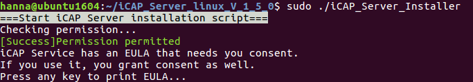

- [1. Intoduction](#1-intoduction)
  - [1.1 Installation Overview](#11-installation-overview)
  - [1.2 Reference Material](#12-reference-material)
- [2. Minimum Requirements](#2-minimum-requirements)
  - [2.1 iCAP Server Requirements](#21-icap-server-requirements)
  - [2.2 iCAP Client Service Requirements](#22-icap-client-service-requirements)
  - [2.3 Service Networking](#23-service-networking)
- [3. Installing iCAP Server](#3-installing-icap-server)
  - [3.1 Installing iCAP Server on Linux](#31-installing-icap-server-on-linux)
    - [3.1.1 Installing Docker Engine on Linux](#311-installing-docker-engine-on-linux)
    - [3.1.2 Installing iCAP Server on Linux](#312-installing-icap-server-on-linux)
    - [3.1.3 Uninstall iCAP Server on Linux](#313-uninstall-icap-server-on-linux)
  - [3.2 Installing iCAP Server on Windows](#32-installing-icap-server-on-windows)
    - [3.2.1 Installing Docker Desktop on Windows](#321-installing-docker-desktop-on-windows)
    - [3.2.2 Installing iCAP Server on Windows](#322-installing-icap-server-on-windows)
    - [3.2.3 Uninstall iCAP Server on Windows](#323-uninstall-icap-server-on-windows)
- [4. Installing iCAP Client Service](#4-installing-icap-client-service)
  - [4.1 Installing iCAP Client Service on Linux](#41-installing-icap-client-service-on-linux)
    - [4.1.1 Installing iCAP Client Service on Linux](#411-installing-icap-client-service-on-linux)
    - [4.1.2 Control iCAP Client Service on Linux](#412-control-icap-client-service-on-linux)
    - [4.1.3 Uninstall iCAP Client Service on Linux](#413-uninstall-icap-client-service-on-linux)
  - [4.2 Installing iCAP Client Service on Windows](#42-installing-icap-client-service-on-windows)
    - [4.2.1 Installing iCAP Client Service on Windows](#421-installing-icap-client-service-on-windows)
    - [4.2.2 Stopping iCAP Client Service](#422-stopping-icap-client-service)
    - [4.2.3 Uninstall iCAP Client Service on Windows](#423-uninstall-icap-client-service-on-windows)
  - [4.3 Setting up iCAP Client Service](#43-setting-up-icap-client-service)
- [Appendices](#appendices)
  - [A. Get Server IP address](#a-get-server-ip-address)

<div style="page-break-after: always;"></div>

-------------------------------------
## 1. Intoduction
&emsp;Innodisk cloud administration platform (iCAP) is a remote device management system for both private and public clouds, which primarily focuses on storage device management and monitoring. You will learn how to setup iCAP Server and install iCAP Client Service from this document.
### 1.1 Installation Overview
&emsp;The installation of iCAP can be divide into two parts: Server and Client service.
<div align=center>

</div>
<div align=center>Figure 1. iCAP Architecture</div>


&emsp;You **MUST** be setup iCAP Server at the first, since is the core of the iCAP service. Here we give a brief introduce for iCAP Server installation:
1. Install the Docker server.
2. Download the iCAP Server images.
3. Run the installation script.
4. Verify the end-user license agreement(EULA) and waitting for the installation.

&emsp;After that, the Client service will connect to the server which setup on the pervious step:
1. Download the iCAP Client service installer.
2. Install iCAP Client service.
3. Modify the server setting for the iCAP Client service which installed on before step.

### 1.2 Reference Material
&emsp;Here we list some reference link can helps you to installation:
- We recommed using Ubuntu to build iCAP Server, you can download it from its offical site: [https://www.ubuntu.com/](https://www.ubuntu.com/)
- We used the Docker to containize the iCAP Server since it can easy to deployment the server into anywhere, the offical site: [https://www.docker.com/](https://www.docker.com/)

-------------------------------------
## 2. Minimum Requirements
&emsp;This section describe the minimum requirements of iCAP. Make sure your system is meet or higher than the following hardward requirements. If your system is lower than minimum requirements maybe affect the performance of iCAP.

### 2.1 iCAP Server Requirements
&emsp;Hardware Minimum Requirement:
- Intel®Core™i5, 3.00GHz
- 8 GB RAM
- 20 GB root partition for the system
- 100 GB data storage partition for documents and indexing 

&emsp;Operating System
- Ubuntu 16.04+ 64-bit
- Microsoft Windows Server 2016 (1709)/Microsoft Windows Pro/Enterprise/Education 64-bits (1607 Anniversary Update, Build 14393 or later)
- Docker 17.03+ 

### 2.2 iCAP Client Service Requirements
&emsp;Hardware Minimum Requirement
- Bundled with Innodisk Storage products
  
&emsp;Operating System
- Windows Server 2016 64-bits
- Windows Server 2012/2012 R2 64-bits
- Windows Server 2008/2008 R2 64-bits
- Windows 10/8.1/7/XP kernel 32/64-bits
- Ubuntu 12.04+ 64-bits
- Debian 8 64-bits

### 2.3 Service Networking
&emsp;The minimum requirement of networking is LocalAreaNetwork(LAN), since the iCAP Service is based on IoT/M2M networking architecture. We needs using some port for data collection and device monitoring, however, we does **not** transmit any packet back. That is, the internet connection is not requirement.

&emsp;Here we list the iCAP Server using ports:
- 80 : For web service using.
- 1883 : For data and command transmission.

&emsp;And the following list is the iCAP Client service binding ports:
- 2888 : For the client protal and the client service API using.
- 2889 : For remote device using.

-------------------------------------
## 3. Installing iCAP Server
&emsp;In this section, we will describe the installation step which the users need to know. You can get these imges from our sales/PMs to deployment the iCAP Server into your server. You can choose the platform you needs whenever it can running the Docker service.

### 3.1 Installing iCAP Server on Linux

#### 3.1.1 Installing Docker Engine on Linux
&emsp;Since the iCAP Server is based on Docker service, we need to install the Docker engine on the host. If the Docker engine already installed on your host, you can skip this step. This command using for check the docker engine:
```
$ docker -v
```
<div align=center>

</div>
<div align=center>Figure 2. Docker version result</div>

&emsp;If your host was installed docker engine, the result should be similar with Figure 2, otherwise, you can install docker server with following command:
1. Update the apt package index:
```
$ sudo apt-get update
```
2. Install packages to allow apt to use a repository over HTTPS:
```
$ sudo apt-get install \
    apt-transport-https \
    ca-certificates \
    curl \
    gnupg-agent \
    software-properties-common
```
3. Add Docker’s official GPG key:
```
$ curl -fsSL https://download.docker.com/linux/ubuntu/gpg | sudo apt-key add -
```
4. Use the following command to set up the **stable** repository. 
```
$ sudo add-apt-repository \
   "deb [arch=amd64] https://download.docker.com/linux/ubuntu \
   $(lsb_release -cs) \
   stable"
```
5. Update the package database with the Docker packages:
```
$ sudo apt-get update
```
6. Install Docker engine:
```
$ sudo apt-get install -y docker-ce
```
7. After installation, you can use the systemctl command to check docker engine was active:
```
$ sudo systemctl status docker
```
&emsp;The result should be similar to the following, shown as Figure 3.
<div align=center>

</div>
<div align=center>Figure 3. Docker status result</div>

&emsp;If you have any question for installation Docker engine, you can reference the documentation on the Docker offical website: https://docs.docker.com/engine/installation/linux/docker-ce/ubuntu/

#### 3.1.2 Installing iCAP Server on Linux
&emsp;After you got the iCAP Server imges compressed file, you needs to decompress this. This command using for decompress:
```
$ tar zxvf iCAP_Server_linux_V_x_x_x_.tar.gz
```
&emsp;Decompression will take few minutes (depends on the host performance), after that, you will get the image files shown as following:
<div align=center>

</div>
<div align=center>Figure 4. Decompress file list</div>

&emsp;Figure 4 shows the decompress file results. Here we take a brief describe of these files:
- **eula.md** : The EULA of the iCAP Server.
- **icap_admindb.tar** : The iCAP administrator database image.
- **icap_coreservice_dashboardagent.tar** : The iCAP dashboard agent image.
- **icap_coreservice_datahandler.tar** : The iCAP data handler image.
- **icap_coreservice_dlm.tar** : The iCAP data life management image.
- **icap_coreservice_dm.tar** : The iCAP device management image.
- **icap_coreservice_innoagemanager.tar** : The innoAGE manager image.
- **icap_coreservice_notify.tar** : The iCAP notification service image.
- **icap_coreservice_storanalyzer.tar** : The iCAP storage analyzer image.
- **icap_datadb.tar** : The iCAP data database image.
- **icap_dbchecker.tar** : The DB checker image for the iCAP databases.
- **icap_gateway.tar** : The Service gateway image of iCAP Server.
- **icap_redis.tar** : The redis database image.
- **iCAP_Server_Installer** : The installer of the iCAP Server.
- **iCAP_Server_Uninstall.sh** : The iCAP Server uninstall script.
- **icap_webservice_authapi.tar** : The iCAP authentication API image.
- **icap_webservice_dashboardapi.tar** : The iCAP dashboard API image.
- **icap_webservice_deviceapi.tar** : The iCAP device API image.
- **icap_webservice_oobservice.tar** : The iCAP OOB service image.
- **icap_webservice_website.tar** : The iCAP website image.
- **Images.tar.gz** : The iCAP device images initial data.
- **innoAGE-Gateway.tar** : The MQTT broker image for innoAGE web service.
- **innoAGE-WebService.tar** : The innoAGE web service image.

&emsp;While the docker engine was installed, all things is ready to installation of iCAP Server. To install the iCAP Server, just run the installation script which was decompress in previous step.
```
$ sudo ./iCAP_Server_Installer
```

<div align=center>

</div>
<div align=center>Figure 5. Installation script - check preminssion</div>

&emsp;At first, this script will check your premission since the docker command need it. And it will check the docker engine was exists or not. Next step, press enter to show the end user license agreement(EULA) shown as Figure 6.

<div align=center>

</div>
<div align=center>Figure 6. Installation script - EULA</div>

&emsp;You can press ”d” to page down, ”u” to page up, and ”q” to quit the EULA.
<div align=center>

</div>
<div align=center>Figure 7. Installation script - accept EULA</div>

&emsp;Type ”yes” if you agree this EULA (shown as Figure 7), an press enter to contiune the installation. The installation script will loading the image to local docker image repositroy from the files decompress at first step.

<div align=center>

</div>
<div align=center>Figure 8. Installation script - load image</div>

&emsp;After loading image files process done, the script will check the iCAP Server is already installed. If exists, it will ask you to make sure to reinstall iCAP Server.
<div align=center>

</div>
<div align=center>Figure 9. Installation script - reinstall question</div>

&emsp;If your answer is yes, type ”y” and press enter, the script will reinstall iCAP Server.
<div align=center>

</div>
<div align=center>Figure 10. Installation script - remove containers</div>

&emsp;After that, the script will mount the images into docker containers automatically, which was load from previous step.
<div align=center>

</div>
<div align=center>Figure 11. Installation script - mount containers</div>

&emsp;If there does not contain with any error, the iCAP Server will work find now. You can check your iCAP Server status from following commnad:
```
$ sudo docker ps -a
```
&emsp;And the result will similar with Figure 12.
<div align=center>

</div>
<div align=center>Figure 12. Check containers</div>

&emsp;If you wants to check the iCAP Server loading, you can use this command to observe containers loading:
```
$ sudo docker stats --all --format "table {{.Name}}\t{{.CPUPerc}}\t{{.MemPerc}}\t{{.MemUsage}}"
```
&emsp;And the shell will shows the container name, cpu loading, memory loading and memory usage, and reflash in every seconds.
<div align=center>

</div>
<div align=center>Figure 13. Containers loading</div>

&emsp;After the containers are working normally, you can visit **http://your_host_name** through any browser. About how to get your iCAP Server IP address, you can reference to Appendix A.
<div align=center>


</div>
<div align=center>Figure 14. Login page</div>
&emsp;When you see the login page, the iCAP Server already working correct. The default account of the iCAP Server are shown as follows:

<center>

| Account | Password |  Permission   |
| :------:| :------: | :-----------: |
|  admin  |  admin   | administrator |
|  guest  |  guest   |     guest     |

</center>

<div align=center>
Table 1. Default account
</div>

&emsp;You can use any account to login the iCAP Server, the website will redirect to the dashboard when the login process is done.

#### 3.1.3 Uninstall iCAP Server on Linux
&emsp;If you want to remove the iCAP Server from your server, you can use the uninstall script to remove it. The following step will help you to uninstall iCAP Server.

&emsp;**It will remove all the data which iCAP Server used. Please use carefully.**

&emsp;To remove the iCAP Server, you can run the uninstall script which was decompress in section 3.1.2
```
$ sudo ./iCAP_Server_Uninstall.sh
```
&emsp;The uninstall script will show some warning message to check you wants to remove iCAP Server.
<div align=center>

</div>
<div align=center>Figure 15. Uninstall script - warning message</div>
&emsp;Type ”y” to remove the iCAP Server. If the remove process is running in normal, the results will shown as Figure 16.
<div align=center>

</div>
<div align=center>Figure 16. Uninstall script - uninstall result</div>

### 3.2 Installing iCAP Server on Windows

#### 3.2.1 Installing Docker Desktop on Windows
&emsp;Before running Docker service on windows, you need to enable HyperV first. If you are using Win10, enter **Control Panel** -> **Programs** -> **Turn Windows features on or off** then check **Containers** and **HyperV**.
<div align=center>

</div>
<div align=center>Figure 17. Windows features check box</div>

&emsp;After **Containers** and **HyperV** are ready, you can visit the Docker official website(https://www.docker.com/products/docker-desktop) to download **Docker Desktop**. After the download is complete, please go to the path of the downloaded file and Double-click **Docker for Windows Installer** to run the installer.

&emsp;When the installation finishes, Docker starts automatically. The whale in the notification area indicates that Docker is running, and accessible from a terminal.

<div align=center>

</div>
<div align=center>Figure 18. Whale icon</div>

&emsp;Docker is available as long as the Docker Desktop for Windows app is running(shown as Figure 19). Settings are available on the UI, accessible from the Docker whale in the taskbar(shown as Figure 20).

<div align=center>

</div>
<div align=center>Figure 19. Docker Desktop is running</div>

<div align=center>

</div>
<div align=center>Figure 20. Docker whale in the taskbar</div>

&emsp;At last, you have to share C drive as Figure 21.

</div>
<div align=center>Figure 21. Share C drive in docker settings</div>

#### 3.2.2 Installing iCAP Server on Windows
&emsp;After you got the iCAP Server imges compressed file, you needs to decompress it. Decompression will take few minutes(depends on the host performance), after that, you will get the image files shown as following:
<div align=center>

</div>
<div align=center>Figure 22. Windows decompress file list</div>

&emsp;Begin to install, click **iCAP_Server_Installer.exe**.The further steps refer to section 3.1.2.
**Note: If unable to connect to the server, please check out your server system firewall setting.**

&emsp;If server reboot, iCAP will restart automatically. A window will pop up like Figure 23. After all containers restart successfully, the window will close by itself. Then the iCAP can work normally.
<div align=center>

</div>
<div align=center>Figure 23. Pop-up window when system reboot</div>

#### 3.2.3 Uninstall iCAP Server on Windows
&emsp;Click **iCAP_Server_Uninstall.exe** to uninstall. It will shown like Figure 24.
<div align=center>

</div>
<div align=center>Figure 24. Uninstall iCAP Server on Windows</div>


-------------------------------------
## 4. Installing iCAP Client Service
&emsp;This section will describe the installation step of the iCAP Client Service. Same as iCAP Server, you can get the installation files from our sales/PMs to install client service. The iCAP Client Service can be install in many platform, such as Microsoft Windows, Ubuntu, Debian, etc. In this document, we used the Windows 10 and Ubuntu 16.04LTS to describe the installation steps.

### 4.1 Installing iCAP Client Service on Linux

#### 4.1.1 Installing iCAP Client Service on Linux
&emsp;The following steps will help you to install iCAP Client Service on your device. To install the linux version of iCAP Client Service, you must have the permission of root.
1. Decompress the iCAP Client Service compressed file:
```
$ sudo tar zxvf iCAP_ClientService_linux_V_x_x_x.tar.gz
```
&emsp;After the decompression, you will get a folder named **iCAP_ClientService_linux** and files shown as following:

<div align=center>

</div>
<div align=center>Figure 25. Decompressed file list</div>

&emsp;Here we take a brief description of these files:
- **Dependencies.sh** : The scipt for installing iCAP Client Service dependent softwares. **You just need to run this script for the first time you installed.**
- **eula.md** : The EULA file.
- **iCAP_Client.service** : The service unit configuration.
- **iCAP_ClientService_64** : The iCAP Client Service program.
- **Install.sh** : The installation script of iCAP Client Service.
- **ServiceSetting.json** : The iCAP Client Service setting file.
- **Uninsatll.sh** : The uninstall script of iCAP Client Service.
- **wwwroot** : The files of client web.

2. For the first install, you have to get some dependencies:
```
$ sudo ./Dependencies.sh
```
&emsp;Please note that you don’t have to run this script if it’s not your first time to install iCAP Client on this device.

3. Run the installation script:
```
$ sudo ./Install.sh
```
&emsp;And the result will shown as follows:

<div align=center>

</div>
<div align=center>Figure 26. The installation script results</div>

4. After the installation of iCAP Client Service, you can check the iCAP Client Service status as following command:
```
$ systemctl status iCAP_Client.service
```
&emsp;If the service is running, you can see the result is like:

<div align=center>

</div>
<div align=center>Figure 27. The status of iCAP Client service</div>

#### 4.1.2 Control iCAP Client Service on Linux
&emsp;You can control your service by running commands:
```
$ systemctl stop iCAP_Client.service
$ systemctl start iCAP_Client.service
$ systemctl restart iCAP_Client.service
```
&emsp;You can use following command to check the iCAP Client service logs:
```
$ cat /var/iCAP_Client/ServiceLog.log
```

#### 4.1.3 Uninstall iCAP Client Service on Linux
&emsp;The following steps will help you to uninstall iCAP Client Service on your devices.
1. Run the uninstall script:
```
$ sudo ./Uninstall.sh
```
2. The uninstall script will double-check for your command, if you wants to remove the iCAP Client Service, type ”y” and press enter. After that, the iCAP Client will be remove from your device.

<div align=center>

</div>
<div align=center>Figure 28. Uninstall result</div>

### 4.2 Installing iCAP Client Service on Windows

#### 4.2.1 Installing iCAP Client Service on Windows
&emsp;The following steps will help you to install iCAP Client Service on your devices.
1. Double-click the **iCAP_ClientService_win32_x.x.x.exe** installer.
2. Click the **Next** button to open End User License Agreement window.

<div align=center>

</div>
<div align=center>Figure 29. Installshield wizard welcome page</div>

3. Click the **I Agree** button if you agree the EULA.

<div align=center>

</div>
<div align=center>Figure 30. Installshield wizard license agreement page</div>

4. Cancel the check box if you do not needed to create the shortcuts on desktop, and click the **Next** button to open Location window.

<div align=center>

</div>
<div align=center>Figure 31. Installshield wizard components page</div>

5. Choose the location you wants to install iCAP Client Service, and click the **Install** button to install iCAP Client Service.

<div align=center>

</div>
<div align=center>Figure 32. Installshield wizard location selection page</div>

6. When the installation complete, click the **Close** button to exit setup program.

<div align=center>

</div>
<div align=center>Figure 33. Installshield wizard process page</div>

#### 4.2.2 Stopping iCAP Client Service
&emsp;The iCAP Client Service will collect your device information and transmit into the iCAP Server which installation on you server. You can stop the iCAP Client Service from the Windows Service Dialog, shown as following:
1. Open the ”**Control Panel**”->”**System and Security**”->”**Administrative Tools**”->”**Services**”
2. Find out the **iCAP Client Service**, and double click to open setting window.

<div align=center>

</div>
<div align=center>Figure 34. The Windows service dialog</div>

3. Than you can click the **Stop** button to stop the iCAP Client Service.

<div align=center>

</div>
<div align=center>Figure 35. The iCAP Client serivce properties dialog</div>

#### 4.2.3 Uninstall iCAP Client Service on Windows
&emsp;The following steps will help you to uninstall iCAP Client Service on your devices.
1. Running the ”Uninstall.exe” program.
2. Click the **Uninstall** button to uninstall iCAP Client Service.

<div align=center>

</div>
<div align=center>Figure 36. The uninstall description page</div>

3. When the uninstallation complete, click the **Close** button to exit uninstall program.

<div align=center>

</div>
<div align=center>Figure 37. Uninstall progress page</div>

### 4.3 Setting up iCAP Client Service
&emsp;To setup the iCAP Client service, you can connect to the client protal via **http://localhost:2888**, or open up from the shortcuts shown as figure 38:

<div align=center>

</div>
<div align=center>Figure 38. iCAP Client protal shortcuts</div>

&emsp;Figure 39 is shown the client portal dashboard, to describe the client service captured status of this device.

<div align=center>

</div>
<div align=center>Figure 39. iCAP Client protal dashboard</div>

&emsp;In the left-top column of the dashboard shown as the server IP and connection status. The following table is shown the light color of the status definition:
<center>

|Color|Description|
|:---:|:---------:|
|Red|The client service is not working.|
|Orange|The client service is working, but connection to the iCAP Server fail.|
|Green|The client service is working, and connection to the iCAP Server successfully.|

</center>

<div align=center>
Table 2. The light color of the status definition
</div>

&emsp;And following steps are shown how to set up the connecting server IP address:

1. Click the menu button which on the left-top of the page, and the menu will pop-out from the left side.

<div align=center>

</div>
<div align=center>Figure 40. iCAP Client protal menu</div>

2. Click the **Setting** button switch into the setting page, and key-in the server IP into the form.

<div align=center>

</div>
<div align=center>Figure 41. iCAP Client protal device setting page</div>

3. After key-in the server IP, click the **Submit** button to write the setting into the iCAP Client service.
4. While the setting was store into the client database, the client service will reconnect with new setting parameters, while the process is done, the Figure 42 will show on the up of the submit button.

<div align=center>

</div>
<div align=center>Figure 42. Setting success pop-out message</div>

5. When the setting process was successful, you can click the top iCAP logo switch into the dashboard to check the client service connection status.

<div align=center>

</div>
<div align=center>Figure 43. Setting done and connection successfully</div>

-------------------------------------
## Appendices

### A. Get Server IP address
&emsp;This section describe how to get the iCAP Server IP address. You can use these command to get the server network cards name:
```
$ ifconfig | grep "inet addr"
```
<div align=center>

</div>
<div align=center>Figure 44. ifconfig result</div>

&emsp;As shown as Figure 44, there have many IP address list on the result. Since we used the Docker internal network to the inter-container communication, the Docker internal network will used the IP address from 172.17.0.0 to 172.32.0.0, with the netmask 255.255.0.0(Class B netwrok). And the IP address 127.0.0.1 is the localhost. That is, the IP address of the server is 172.16.36.80 from Figure 44. You can reference the brief content to find your server IP address.

&emsp;For more detail of the **ifconfig** command, you can reference this site: https://linux.die.net/man/8/ifconfig.

&emsp;For more information of the Docker networking, you can reference: https://docs.docker.com/engine/userguide/networking/.

-------------------------------------
